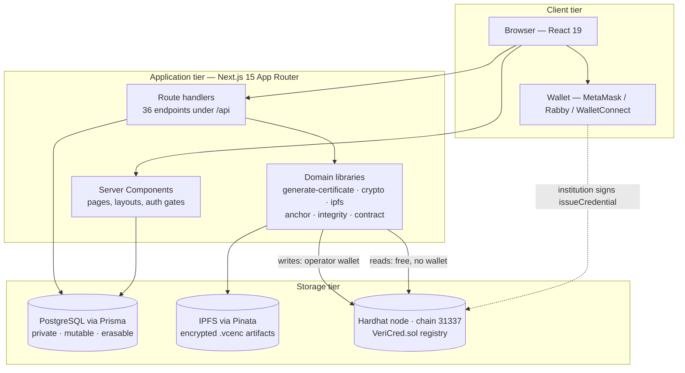
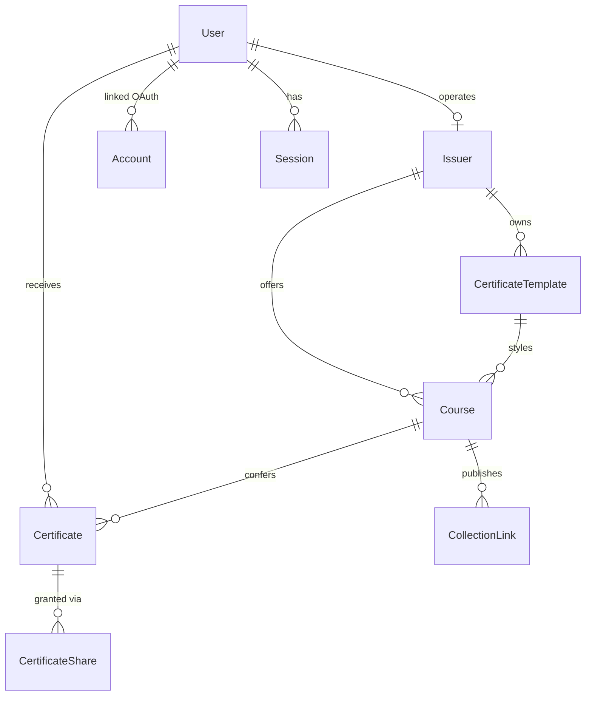
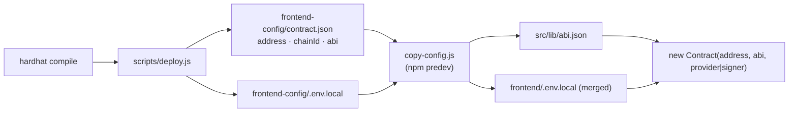
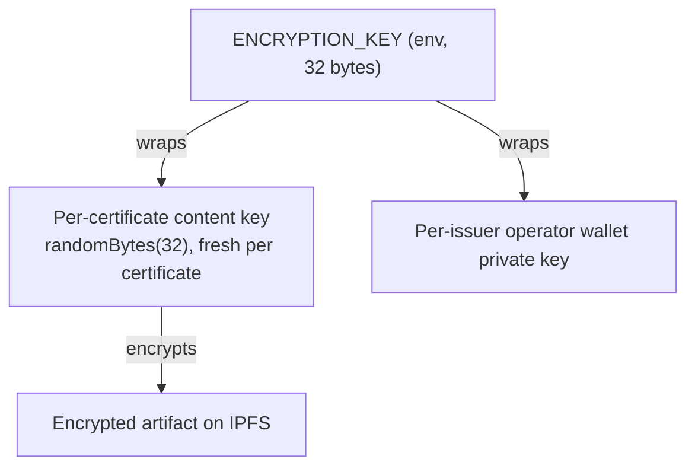
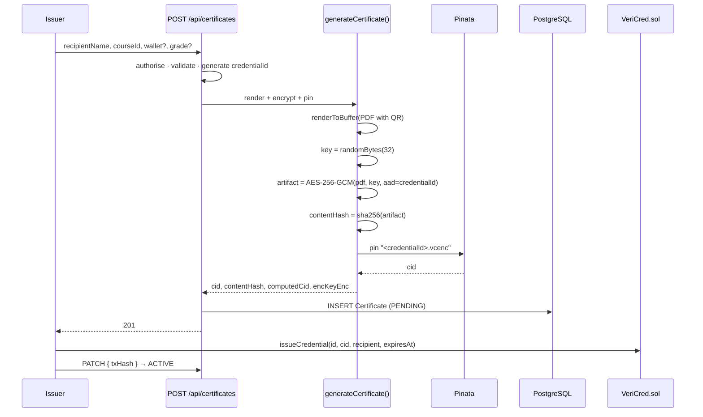

# VeriCred — System Design

**Module:** CT124-3-3-BCD — Blockchain Development
**Group:** 14 · Asia Pacific University of Technology and Innovation
**Companion documents:** [`02_assumptions.md`](./02_assumptions.md) · [`04_setup.md`](./04_setup.md) · [`01_PRD.md`](./01_PRD.md)

### Group Members

| Name | TP Number |
|---|---|
| Leanard Tang YiShiun | TP070029 |
| Low Teck Chi | TP064234 |
| Tan Jun Hong | TP071266 |
| Ng Jian Hwa | TP070698 |

---

## Contents

1. [The problem and the shape of the solution](#10-the-problem-and-the-shape-of-the-solution)
2. [System architecture](#20-system-architecture)
3. [The hybrid storage model](#30-the-hybrid-storage-model)
4. [Smart contract design](#40-smart-contract-design)
5. [Database design](#50-database-design)
6. [Application design](#60-application-design)
7. [Security design](#70-security-design)
8. [Principal flows](#80-principal-flows)
9. [Design decisions and trade-offs](#90-design-decisions-and-trade-offs)
10. [Known divergences between design and implementation](#100-known-divergences-between-design-and-implementation)

---

## 1.0 The problem and the shape of the solution

An employer holding a degree certificate can accept it at face value, contact the issuing institution and wait, or pay a proprietary verification intermediary. The first is unsafe, the second does not scale, and the third reintroduces the centralised trust anchor that verification is supposed to remove.

Two structural weaknesses cause this. A certificate presented as a document carries no cryptographic binding to its issuer, so it is trivially forgeable. And the institutional database of record is mutable and centrally controlled, so an authoritative answer from the issuer is only as good as that institution's internal controls at the moment of the enquiry.

A blockchain addresses the second weakness directly: a public ledger is append-only, replicated, and cannot be retroactively altered by the party that wrote to it. The engineering problem is therefore not *whether* to use a ledger but **what to put on it**, given that a public ledger is permanent, world-readable, and consequently the worst possible home for personal data.

VeriCred's answer is to put **a fingerprint, not a document**, on the ledger — and to make that fingerprint the file's own content hash, so that it is simultaneously the retrieval address and the tamper-evidence seal.

---

## 2.0 System architecture

### 2.1 Tiers



Two properties of this topology are load-bearing.

**The ledger is written from two positions.** An institution with a wallet connected signs from the browser. When no member of the institution is present — a graduate claiming a collection link at three in the morning — a platform-custodied *operator wallet* signs server-side, still attributing the credential to that institution on-chain.

**Ledger reads need nothing.** All contract read paths are `view`, so they cost no gas, require no signature, and need no account. This is what allows public verification to work for an anonymous visitor.

### 2.2 Layer responsibilities

| Layer | Responsibility | Must not |
|---|---|---|
| `contracts/VeriCred.sol` | Anchor fingerprints and lifecycle state; enforce authority | Hold personal data, or permit an overwrite |
| `src/lib/` domain modules | Render, encrypt, pin, hash, sign, verify | Import React or Next.js request objects |
| `src/app/api/` handlers | Authorise the session, validate input, orchestrate | Contain cryptographic or business logic |
| `src/app/` pages | Present | Query the contract for writes without a wallet |
| PostgreSQL | Hold everything the contract refuses to | Be treated as authoritative over the chain |

The rule that keeps this testable is that domain modules are framework-free. `lib/auth-credentials.ts` deliberately imports nothing from `next-auth`, so authorisation rules can be unit-tested without booting the framework; `lib/auth.ts` does nothing but adapt a domain `AuthorizationError` into the `CredentialsSignin` subclass Auth.js needs. The same principle puts the navigation model in `lib/navigation.ts` as pure functions.

---

## 3.0 The hybrid storage model

### 3.1 The allocation

| Data | Store | Why there |
|---|---|---|
| Issuer and recipient wallet addresses | Chain | Pseudonymous; needed to attribute and address the award |
| IPFS CID | Chain | The integrity fingerprint; must be immutable to be probative |
| Issued / revoked / expiry timestamps, revocation flag and reason | Chain | Lifecycle state a verifier must trust without asking the issuer |
| Encrypted certificate document | IPFS | Content-addressed, replicated, retrievable by CID |
| Recipient name, e-mail, **grade**, course description, template layout | PostgreSQL | Personal or descriptive; must stay mutable and erasable |
| Accounts, sessions, collection links, share grants | PostgreSQL | Application state with no evidentiary role |

### 3.2 Why the CID is enough

An IPFS CID is a multihash computed over the file's own bytes. Change one bit and the file hashes to a different CID, which no longer matches what was anchored. The CID is therefore both the address and the seal, and **no separate "certificate hash" field is needed** — which is why the contract does not have one.

### 3.3 Why encryption alone would have protected nothing

This is the subtlest decision in the system and is worth stating carefully.

The rendered PDF carries recipient name, course, issuer, issue date, credential ID and a QR code. The unauthenticated endpoint `GET /api/verify/[credentialId]` already returns every one of those. So a PDF that was merely encrypted would contain **no field that was not already public**, and encryption would close exactly one narrow vector: indefinite public retrievability of the file by anyone who has ever seen the CID.

The fix is therefore *two* changes, not one:

1. **Encrypt the artifact** — AES-256-GCM under a fresh per-certificate content key.
2. **Give it content the public interface withholds** — the awarded `grade`, rendered onto the encrypted document only, absent from the verify response and absent from the public preview image.

Without the second change, the privacy argument would be rhetorical. With it, the public artifact and the encrypted artifact are genuinely *different documents*, which is what makes the hybrid claim literally true.

### 3.4 Why verification still works without a key

Proving a certificate is untampered is: fetch by the **chain's** CID → hash the bytes → compare. That is a hash over ciphertext, and hashing ciphertext is exactly as conclusive as hashing plaintext.

So a verifier with no key can still prove authenticity. **Encryption costs tamper-evidence nothing.** It does cost public inspectability — an anonymous party can no longer read what was anchored, only that it is unaltered — and the server-rendered PNG preview exists precisely to restore the presentational value that loss would otherwise destroy.

---

## 4.0 Smart contract design

### 4.1 Governing principles

1. **No personal data on-chain.** Only addresses, a CID, and lifecycle metadata.
2. **A credential ID is anchored exactly once.** An overwrite would let an institution swap the file behind an identifier an employer had already verified, defeating the point of anchoring anything.
3. **Revocation is append-only.** It sets a flag and records a reason; the issuance record and the original `CredentialIssued` event survive permanently.
4. **Existence and validity are separate.** A forgery that was never anchored and a genuine award since withdrawn are different situations, and an employer must be able to distinguish them.
5. **Verification is free.** Every read path is `view`.

### 4.2 Storage layout

```solidity
struct Credential {
    address issuer;           // 20 bytes ─┐
    uint40  issuedAt;         //  5 bytes  │ 31 bytes → one 32-byte slot
    uint40  revokedAt;        //  5 bytes  │
    bool    revoked;          //  1 byte  ─┘
    address recipient;        // 20 bytes ─┐ 25 bytes → next slot
    uint40  expiresAt;        //  5 bytes ─┘
    string  cid;              // the integrity fingerprint
    string  credentialId;     // e.g. "VC-2026-0001"
    string  revocationReason;
}
```

Field ordering is deliberate. The EVM addresses storage in 32-byte words and solc packs consecutive fields that fit. Timestamps are `uint40` rather than `uint256` specifically to make that packing possible; `uint40` holds Unix seconds until the year 36812, so nothing practical is given up.

Because mappings are not enumerable, two auxiliary indexes are maintained: a global array of ID hashes, and a per-recipient array with a companion position map that makes removal O(1) during a transfer (the *swap-and-pop* idiom).

Existence is marked by a **non-empty CID** rather than a separate boolean — one fewer storage slot, and it cannot desynchronise, because `issueCredential` rejects an empty CID.

### 4.3 Authority model

| Role | Granted by | Can |
|---|---|---|
| Admin | Constructor (`msg.sender`), or `transferAdmin` | Authorise/remove institutions, revoke any credential, transfer the role |
| Institution | `authoriseInstitution` (admin only) | Issue single or batch; revoke its own |
| Recipient | Being `credential.recipient` | Transfer custody |
| Anyone | — | Read everything, free |

One rule deserves emphasis:

```solidity
/// @dev Credentials it already anchored remain valid. Losing the right
///      to issue in future is not the same as your past awards being
///      void, and the contract must not conflate the two.
function removeInstitution(address institution) external onlyAdmin { ... }
```

A university that loses accreditation has not un-awarded its prior degrees. A dedicated test asserts that after removal the institution's next `issueCredential` reverts while `isValid` on its earlier credential still returns `true`.

### 4.4 Error handling

Fifteen custom errors replace `require` strings. Since Solidity 0.8.4 a custom error encodes as a four-byte selector plus ABI-encoded arguments, which is cheaper in both deployment and revert-path gas than embedding a revert string in bytecode.

The application maps them back to human-readable messages in `lib/errors.ts`. Note the mechanism precisely: `parseContractError` collects candidate strings from the thrown error (`shortMessage`, `reason`, `message`, `info.error.message`, `data`) and **substring-matches the error's name** against a hard-coded table. It does not decode the four-byte selector from the ABI. This is functionally adequate but more brittle than true selector decoding, and is a candidate for hardening.

### 4.5 Batch issuance

Graduation is a batch event — a cohort is conferred on one day — so `issueCredentialBatch` amortises the ~21,000 gas transaction base cost across many credentials. Arrays are `calldata` (no memory copy), lengths are checked once before the loop, and the loop uses `++i`.

**Measured, so the claim is not left qualitative:** a 50-item batch cost 10,701,988 gas (214,039 per credential) against 245,814 for a single `issueCredential` — a saving of roughly **13%**. Two caveats follow from the measurement and should not be omitted:

- The dominant cost is per-credential storage, not the base fee, so the saving is real but modest.
- 200 credentials in one transaction would need roughly 42.8M gas, **above Ethereum's ~30M block gas limit**. The application's 100-row batch cap already implies ~21M gas, over half a block. Batch size has a hard ceiling.

Two further notes on optimisation honesty: at the configured optimiser setting (200 runs) `++i` and `i++` compile to identical bytecode, so the pre-increment is stylistic rather than a saving; and the loop is *not* wrapped in `unchecked { ++i }`, which is the optimisation that would actually survive (~30–40 gas per iteration).

### 4.6 Verification semantics

`verifyCredential` returns `exists` and `valid` separately, yielding four distinguishable outcomes:

| `exists` | `valid` | Meaning | UI |
|---|---|---|---|
| false | false | Never anchored — probable forgery | Not Found (red) |
| true | true | Anchored, live | Valid (green) |
| true | false (revoked) | Genuinely issued, since withdrawn | Revoked (amber) + reason |
| true | false (expired) | Genuinely issued, term elapsed | Expired (grey) |

Enumeration accessors are paginated. Although `view` calls cost no gas externally, nodes impose an execution cap on `eth_call`; an unpaginated accessor would work in development and fail at realistic scale — a failure mode discovered only in production.

---

## 5.0 Database design

### 5.1 Entity model



*`VerificationToken` (Auth.js e-mail tokens) is the tenth model and is omitted above, having no relations.*

| Model | Role |
|---|---|
| `User` | Identity: name, username, e-mail, password hash, wallet, role |
| `Account`, `Session`, `VerificationToken` | Auth.js adapter tables |
| `Issuer` | Institution: organisation name, on-chain wallet, operator wallet, approval status |
| `CertificateTemplate` | Reusable JSON layout |
| `Course` | Binds an issuer to a template |
| `Certificate` | Recipient, CID, txHash, status, encryption bookkeeping |
| `CertificateShare` | Revocable grant to open one certificate's document |
| `CollectionLink` | Self-service claim link with caps and expiries |

### 5.2 Two wallets per institution

`Issuer.walletAddress` is the organisation's own wallet — staff control it and sign with it interactively. `Issuer.operatorAddress` is generated by the platform, its key stored encrypted in `operatorKeyEnc` and decrypted only in-process. Both are authorised on-chain at approval.

The point of the split: a certificate anchored automatically, with nobody from the institution present, still reports **that institution** as its on-chain `issuer` — never the platform administrator.

### 5.3 Encryption bookkeeping

Three columns exist purely for cryptographic accounting:

| Column | Holds |
|---|---|
| `encKeyEnc` | The per-certificate content key, itself encrypted under `ENCRYPTION_KEY` |
| `contentHash` | `sha256:<hex>` of the exact bytes pinned (ciphertext, including its `VCE1` header) |
| `computedCid` | A CIDv1 recomputed locally from those same bytes before pinning |

`encKeyEnc IS NULL` marks a **legacy** row whose `cid` points at a plaintext PDF. Legacy rows are deliberately not backfilled: re-encrypting would produce a CID that disagrees with one already anchored immutably, and the original plaintext CID is the historically correct anchor for what was actually issued.

### 5.4 Protecting the key at the ORM boundary

A recurring ORM defect is accidentally serialising a sensitive column because a handler returns a whole model. This is closed at the client rather than per call site:

```typescript
export const prisma = new PrismaClient({
  omit: { certificate: { encKeyEnc: true } },
});
```

A route must therefore opt *in* to see the key, which is the safe direction — a newly written handler inherits the protection without its author knowing the column exists. Exactly **two** modules opt back in, both on the decryption path: `api/certificates/[id]/document/route.ts` and `lib/certificate-share.ts`.

*(The doc comment in `lib/prisma.ts` naming `lib/certificate-document.ts` as the single opt-in site is stale; that module receives the key from its callers rather than querying for it.)*

### 5.5 Lifecycle modelled in the schema

`cid`, `txHash`, `walletAddress` and `recipientId` are nullable because a certificate legitimately exists before each is known. Nullability models a process with several completion points, not incompleteness.

`CertificateStatus` distinguishes `PENDING` (nobody has claimed it) from `CLAIMED` (ownership confirmed, not yet anchored), because collapsing them conflated two states that mean different things to a recipient reading their dashboard.

---

## 6.0 Application design

### 6.1 Routing

The App Router maps the directory tree to routes. Server Components run on the server and query Prisma directly; Client Components (`"use client"`) are those needing browser APIs — wallets, form state, interactivity. The `(authenticated)` route group carries a layout that resolves the session server-side, so no individual page repeats the check.

22 pages and 36 route handlers. The principal ones:

| Route | Access | Purpose |
|---|---|---|
| `/` | Public | Landing, no navbar |
| `/verify`, `/verify/[credentialId]` | Public | Verification by ID or QR |
| `/c/[credentialId]` | Public | Shareable credential page |
| `/u/[username]` | Public | Holder profile |
| `/s/[token]` | Tokenised | Shared certificate document |
| `/login`, `/login/institution` | Public | Sign-in; institutions have their own page |
| `/register`, `/register/user`, `/register/institution` | Public | Chooser and the two paths |
| `/onboarding` | Authenticated | Mandatory username + wallet for OAuth accounts |
| `/dashboard`, `/dashboard/settings` | Recipient | Credentials; profile and wallet |
| `/issuer/**` | Issuer | Courses, templates, issuance, collection links |
| `/admin` | Administrator | Institution approval and on-chain authorisation |

### 6.2 Authentication

Six sign-in methods across four providers: WalletConnect/injected wallet (SIWE), GitHub, Google, LinkedIn, e-mail+password, and a separate institution provider requiring password **and** signature together.

The SIWE path is the most security-sensitive code in the system and applies three defences: the signature is verified against the message; the nonce is bound to the session CSRF token and checked server-side, defeating cross-session replay; and `assertWalletIsNotInstitution` refuses any address registered as an institution's wallet, so an organisational identity cannot become a personal login.

Session claims resynchronise from the database on a 60-second interval, and immediately on an explicit client `update()`. If the user no longer exists, the callback returns `null`, ending the session rather than honouring a token with stale role claims.

### 6.3 Contract access

Two forms, because server and client differ in capability:

- **Server** (`lib/contract.ts`) — `getReadOnlyContract()` for `view` calls from route handlers; `getSignerContract(signer)` for writes; `getAdminSigner()` returning `null` rather than throwing when `ADMIN_PRIVATE_KEY` is unset, so callers treat it as "unavailable" not "broken".
- **Client** (`hooks/use-contract.ts`) — a memoised read-only instance that works with no wallet, and `getWriteContract()` raising a specific error for each precondition (no address configured / not connected / wrong network).

Both guard the ABI import, because `src/lib/abi.json` starts as `[]` and is populated only by the deploy pipeline. A fresh checkout therefore runs, and the failure — when it comes — is a descriptive message at the point of use rather than a module-load crash on every page.

### 6.4 Configuration pipeline



Automating this removes a class of error where the application is compiled against a stale ABI or a previous address.

### 6.5 Performance design

Anything the root layout imports enters the compilation unit of *every* route. `AppKitProvider` calls `createAppKit()` at module scope, pulling in Reown AppKit (51 MB) and Lit; `Web3Provider` pulls ethers (10 MB). Both were originally in `app/layout.tsx`, so the static landing page compiled the whole WalletConnect stack.

Both are now scoped per route: `Web3Provider` in the six layouts that need contract access, `AppKitProvider` reached only through `next/dynamic` from the three components that use it.

Two distinct measurements, kept separate because they were taken on different bundlers:

| Measurement | Before | After |
|---|--:|--:|
| Provider scoping alone, webpack — `/` modules | 9,166 | 1,147 |
| Provider scoping alone, webpack — `/` compile | 47.7s | 8.3s |
| Full change (webpack+root-layout → Turbopack+scoped) — `/` cold compile | 28.9s | 4.5s |
| AppKit in shared First Load JS | ~900 kB | 0 |

*(The bundler switch alone accounted for 47.7s → 27.1s, independently of scoping.)*

Every route also has a `loading.tsx` to establish a Suspense boundary — without one the router cannot commit the new URL until the RSC payload resolves, freezing the address bar. `app/loading.tsx` is load-bearing: a `loading.tsx` wraps only its segment's children, so per-route files sit below `(authenticated)/layout.tsx` and cannot cover its `await auth()`. Because the fallback ships *inside* the awaited payload, it cannot cover the click-to-URL gap either; `LinkButton` closes that by swapping its label for a spinner on `useLinkStatus()`, which fires on the click itself.

---

## 7.0 Security design

### 7.1 Artifact format

```
[4B "VCE1"][12B IV][16B GCM auth tag][ciphertext]
```

The magic prefix is an artifact-level discriminator independent of any database flag: a plaintext certificate starts `%PDF`, an encrypted one `VCE1`. A wrong or missing `encKeyEnc` therefore can never cause ciphertext to be handed to a PDF viewer, or plaintext to a decryptor.

The `credentialId` is bound in as **AAD**, so an artifact lifted from one certificate and served under another's identifier fails authentication rather than decrypting cleanly.

### 7.2 Key hierarchy



`ENCRYPTION_KEY` never encrypts bulk data — it only ever wraps other keys. Content keys are per-certificate and never reused.

### 7.3 Ordering rules that matter

**Integrity is checked before decryption.** `getCertificatePdf` re-hashes the retrieved bytes against `contentHash` *before* handing anything to a decryptor: bytes that cannot be vouched for should never reach one, still less a user. Where retrieval or verification fails, the route returns 502 rather than silently re-rendering, because a silent fallback would mask exactly the tampering the check exists to catch. *(One exception is deliberate: legacy rows with no content key are re-rendered from PostgreSQL, since their pinned file is a plaintext PDF and there is nothing to decrypt.)*

**Generation happens outside the transaction.** PDF rendering plus an IPFS round trip is far too slow to hold a database transaction open. The collection-link claim path peeks at the link, generates outside, then re-validates authoritatively inside the transaction. The worst outcome of a link expiring in that window is a wasted pin — never a corrupted count or a duplicate claim.

**Revocation is asymmetric with CID divergence.** A certificate revoked off-chain but not yet on-chain reduces validity immediately (`combinedValid`), because reporting a withdrawn credential as valid is the more damaging error. A CID divergence does *not* reduce validity, because invalidating a genuinely anchored credential over what is most likely an administrative slip would be worse; it is surfaced to the user instead.

### 7.4 Registration and authorisation gates

| Gate | Enforced at | Why |
|---|---|---|
| Username + signed wallet mandatory | Registration forms; `needsOnboarding()` | A credential must be addressable |
| E-mail verification blocks **login** | `authorizeEmailPassword` | Not merely dashboard access |
| Institutions need password **and** signature every time | `authorizeInstitution` | Organisational authority warrants proof of key control per session |
| Institution accounts refused at `/login` | `InstitutionMustUseWallet` | Stops the general page being a bypass |
| Wallet uniqueness across **both** tables | `findWalletConflict()` | Reports the issuer match *first* — returning the user match first silently defeated the check, since callers treat a self-match as benign |
| Institution wallet ≠ personal login | `assertWalletIsNotInstitution()` | Otherwise SIWE minted a USER account holding an organisation's address |
| No self-service `ISSUER`/`ADMIN` | By omission | An automatic promotion path is how any compromised account becomes an issuer |

### 7.5 Untrusted inputs

The IPFS gateway is treated as hostile: 15-second timeout, 20 MB cap, and the byte count re-checked after download because `content-length` is advisory. CSV uploads are capped at 1 MB and 100 rows. Grades are truncated to 64 characters. Credential IDs must match `/^VC-\d{4}-[A-Z0-9]{4,12}$/`.

---

## 8.0 Principal flows

### 8.1 Issuance



The two phases are separated deliberately. Phase 1 is authoritative — if it fails, nothing exists. Phase 2 is best-effort — if the wallet is absent, on the wrong network, or the user rejects, the record persists as `PENDING` and can be anchored later. The user is never left with a credential that exists on the ledger but not in the index, which is the unrecoverable ordering.

**Issuers never supply a CID.** Allowing one would let an institution anchor a fingerprint corresponding to no document it actually rendered.

### 8.2 Anchoring

| Path | When | Signer | On-chain `issuer` |
|---|---|---|---|
| Interactive | Institution has a wallet connected | The institution's own wallet | That institution |
| Deferred | Collection-link claim, or a wallet linked later | That institution's operator wallet | That institution |

Deferred batch anchoring groups certificates **by owning institution** before transacting, because one transaction has exactly one `msg.sender` and certificates from different issuers can never share it.

### 8.3 Revocation

Revocation should reach the ledger wherever it can — a withdrawal recorded only in a mutable database is the failure mode the ledger exists to prevent. `PATCH /api/certificates/[id]` therefore **attempts** `revokeCertificateOnChain` before writing the off-chain record.

The attempt is best-effort, and its outcome is reported rather than enforced. It is **skipped** when there is nothing to anchor (the credential was never anchored, or is already revoked on-chain) or when no permitted signer is available, and **failed** when the transaction itself does not land. In every one of those cases the off-chain revocation is still recorded, because a revocation the issuer has asked for must take effect regardless. The result is returned to the caller in an `onChain` field so the interface can say which happened instead of reporting an unqualified success.

Choosing the signer is the whole difficulty, because `VeriCred.sol` accepts a revocation only from the credential's on-chain `issuer` or from the admin, and the issuer is whichever wallet anchored it:

| Credential anchored by | Signer used | Attribution |
|---|---|---|
| Operator wallet (deferred path) | That operator wallet | The institution |
| Institution's own browser wallet | Admin signer — the platform holds no institutional key | Platform admin, exercising override authority |
| Nothing (`PENDING` / `CLAIMED`) | None; chain not touched | — |

The anchored issuer is read back from the chain rather than assumed, since the database does not record which wallet signed. Where no permitted signer exists, the revocation is still recorded off-chain and the outcome is returned to the caller, which the issuer panel surfaces as a warning rather than an unqualified success. The operation is idempotent: a credential already revoked on-chain reports a skip instead of reverting.

### 8.4 Verification

`/api/verify/[credentialId]` composes two sources: the chain (authoritative for existence and validity) and the index (descriptive detail). `exists` is true when *either* has a record — a certificate pinned and indexed but not yet anchored is real, and reporting it as "not found" would be inaccurate. `onChain` distinguishes the two.

Integrity checking (`lib/integrity.ts`) retrieves by the chain's CID and re-hashes, trying two methods strongest-first:

- **`cid`** — the bytes re-derive the anchored value; closes even the dishonest-gateway case.
- **`content-hash`** — the bytes match the sha256 recorded at issuance; still a genuine re-hash, sound because the *retrieval key* came from the chain.

### 8.5 Lifecycle

```mermaid
stateDiagram-v2
    [*] --> PENDING: issued (pinned, row created)
    PENDING --> ACTIVE: anchored
    PENDING --> CLAIMED: claimed, no wallet yet
    CLAIMED --> ACTIVE: wallet linked → auto-anchor
    PENDING --> REVOKED: revoked (off-chain; nothing anchored)
    CLAIMED --> REVOKED: revoked (off-chain; nothing anchored)
    ACTIVE --> REVOKED: revokeCredential + off-chain record
```



Only the transition out of `ACTIVE` has anything to anchor — a `PENDING` or `CLAIMED` certificate has no on-chain record to append a revocation to, so `lib/revoke.ts` skips the chain entirely for those.

`EXPIRED` is defined in the enum but **never written** — expiry is evaluated on-chain by `verifyCredential` and derived at render time. See 1.00.

### 8.6 Sharing

A holder may need to show a certificate, grade included, to one third party. The naïve design hands over the key, typically in a URL fragment — which cannot be revoked and leaks into browser history and forwarded links.

Instead, `CertificateShare` records a token, optional expiry, revocation timestamp and view count, and the server decrypts for a bearer of a live token. **The content key never leaves the server, so revoking the share genuinely revokes access.**

---

## 9.0 Design decisions and trade-offs

| Decision | Alternative rejected | Rationale |
|---|---|---|
| Anchor a CID, not a document | Store data on-chain | Permanence and world-readability make a ledger the worst home for personal data |
| Encrypt the artifact **and** add `grade` | Encrypt only | Encrypting a document of already-public fields protects almost nothing |
| Server-side key custody | Key issued to the holder (proposal 5.4) | The literal design cannot be revoked and leaks the key into history; sharing becomes a revocable grant instead |
| PNG preview re-rendered from Postgres | Serve the pinned file | Ciphertext cannot be rendered; also fixes mobile PDF handling and enables `og:image` |
| `contentHash` load-bearing, `computedCid` best-effort | Require CID recomputation | Pinata's UnixFS parameters are undocumented; a hard assertion would be a production-only tripwire |
| Legacy rows not backfilled | Re-encrypt everything | A new CID would disagree with one already anchored immutably |
| Per-issuer operator wallets | Platform admin signs everything | Preserves correct on-chain attribution to the institution |
| Providers scoped per route | Mount in root layout | Otherwise every route compiles the wallet stack |
| No self-service privilege escalation | Automatic promotion | An automatic path is how a compromised account becomes an issuer |
| Two renderers (`@react-pdf` + satori) | Unify | `@react-pdf` accepts only TTF/OTF; they are different documents by design, so differing glyph metrics are acceptable |

---

## 10.0 Known divergences between design and implementation

Stated here rather than left for a reader to discover. The full treatment is in [`02_assumptions.md`](./02_assumptions.md) 7.

| # | Design intent | Actual behaviour |
|---|---|---|
| 1 | Revocation is anchored on-chain via `revokeCredential` | **Now implemented** (`lib/revoke.ts`). The residual limit is that a permitted signer must exist: the operator wallet where it anchored the credential, otherwise the admin key. Without either, the revocation is recorded off-chain and reported as such rather than silently. |
| 2 | `EXPIRED` is a status a certificate reaches | Never written by any code path. Expiry is evaluated on-chain and derived at render time. |
| 3 | `computedCid` is a stored reference for verification | Stored, but `checkArtifactIntegrity` recomputes from fetched bytes and compares to `cid` — the stored value is only a truthiness gate. The `method: "cid"` path is also unexercised by CI. |
| 4 | Institution approval is all-or-nothing | The **database** writes are atomic and no role is granted unless both on-chain calls succeeded — but the two `authoriseInstitution` transactions are independent with no compensating rollback, so a partial failure can strand an authorisation that a retry does not clean up. |
| 5 | `getOperatorSigner` returns `null` on any problem | It throws when `decrypt` fails on a corrupt key, and both `anchor.ts` call sites invoke it outside their `try` blocks. |
| 6 | Wallet migration transfers credentials on-chain | `transferCredential` is implemented and covered by 13 tests; **no UI invokes it**. |
| 7 | E-mail signup provisions a custody wallet | `custodyAddress`/`custodyKeyEnc` exist; nothing populates them. |
| 8 | Contract errors decoded from their selector | Substring matching on the error name in ethers' surfaced message. |

Item 1 was the most significant of these and has since been closed; the rest stand. Items 2 and 5 are the ones now worth attention.

---

## References

Benet, J. (2014) *IPFS — Content Addressed, Versioned, P2P File System*. arXiv:1407.3561.

Dworkin, M. (2007) *Recommendation for Block Cipher Modes of Operation: Galois/Counter Mode (GCM) and GMAC*. NIST SP 800-38D.

Ethereum Foundation (2024) *Solidity Documentation, v0.8.24*. Available at: https://docs.soliditylang.org/en/v0.8.24/

Ethereum Improvement Proposals (2021) *EIP-4361: Sign-In with Ethereum*. Available at: https://eips.ethereum.org/EIPS/eip-4361

Wood, G. (2014) *Ethereum: A Secure Decentralised Generalised Transaction Ledger*. Ethereum Yellow Paper.
