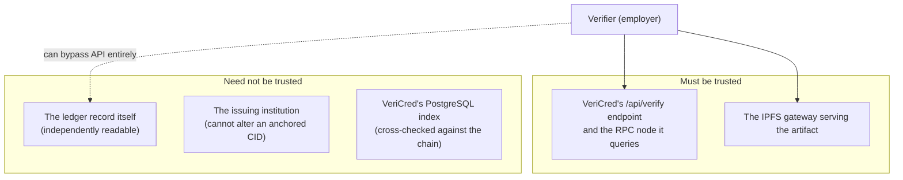

# VeriCred — Assumptions

**Module:** CT124-3-3-BCD — Blockchain Development
**Group:** 14 · Asia Pacific University of Technology and Innovation
**Companion documents:** [`setup.md`](./setup.md) · [`design.md`](./design.md) · [`PRD.md`](./PRD.md)

---

## Purpose of this document

Every system rests on things it takes to be true and does not itself enforce. Where those things are left unstated, a reader cannot tell a deliberate design decision from an oversight, and a reviewer cannot tell what the system actually guarantees from what it merely hopes.

This document states VeriCred's assumptions explicitly, in six categories: deployment, trust, actor behaviour, data, cryptography, and infrastructure. It closes with the assumptions that are **not yet satisfied by the code** — behaviour the design depends on that is specified and tested at the contract layer but not wired into the application. Those are listed plainly rather than left for a reader to discover.

An assumption here is not a claim of correctness. It is a statement of the form *"the system behaves as designed only while X holds"*, together with what happens when X does not hold.

---

## 1. Deployment assumptions

| # | Assumption | If it does not hold |
|---|---|---|
| D1 | The blockchain is a **local Hardhat node** at `http://127.0.0.1:8545`, chain ID **31337**. | Nothing breaks structurally — `NEXT_PUBLIC_RPC_URL` and `NEXT_PUBLIC_CHAIN_ID` are configuration — but gas becomes a real cost and block times stop being instantaneous. |
| D2 | The chain is **single-node and non-adversarial**. There is no mempool competition, no reorganisation, and no MEV. | Transaction ordering assumptions in batch issuance would need revisiting. The contract itself has no ordering dependency, so the exposure is in the application's optimistic UI updates, not on-chain state. |
| D3 | `tx.wait()` returning implies **finality**. On Hardhat, a mined block is final. | On a public chain, one confirmation is not finality. `lib/anchor.ts` and the issuance dialog both treat a single receipt as settled and would need a confirmation depth. |
| D4 | The deployer of `VeriCred.sol` is the **platform administrator**, and is Hardhat Account #0. | The constructor assigns `admin = msg.sender` unconditionally. A deployment from the wrong account yields a contract whose admin is not the platform, recoverable only via `transferAdmin`. |
| D5 | There is **exactly one deployed instance** of the contract, and `frontend-config/contract.json` refers to it. | Re-running `npm run deploy` produces a *new* contract at a new address with an empty registry. Certificates anchored against the previous address become unverifiable — their `txHash` and on-chain record still exist, but the application no longer looks there. Redeploying is therefore destructive to demonstration data. |
| D6 | No block explorer exists for chain 31337, so `NEXT_PUBLIC_BLOCK_EXPLORER_URL` is unset. | The "View on Blockchain Explorer" link is not rendered rather than pointing somewhere broken. This is handled, not assumed away. |

---

## 2. Trust model

This is the most important section in this document, because the project's stated motivation is the removal of a centralised trust anchor, and it is important to be precise about how much of one remains.

### 2.1 What a verifier must trust

**T1 — A verifier using the web interface trusts VeriCred's server.** When an employer loads `/verify/VC-2026-XXXX`, it is VeriCred's own route handler that calls `getReadOnlyContract()` against VeriCred's own RPC endpoint and returns a JSON verdict, which VeriCred's own React component renders as the word "Valid". A dishonest or compromised VeriCred server could lie.

This is a genuine and deliberate limitation, and it is worth being exact about why it is acceptable: **the trust is convenience-only, and there is an escape hatch.** The contract address, the ABI, and the credential ID are all public. Any party who declines to trust VeriCred can call `verifyCredential(credentialId)` themselves — from `cast`, from ethers, from a block explorer, from their own node — and obtain the same answer with no intermediary. That is a materially different position from a proprietary verification service, where no such independent path exists. The system reduces required trust; it does not claim to eliminate it for a user who chooses the convenient path.

**T2 — The ledger is authoritative over the database.** Where the chain and the PostgreSQL index disagree about a CID, the chain is correct by assumption. `/api/verify/[credentialId]` computes a `cidAgreement` field and surfaces a divergence rather than silently preferring either — but it deliberately does *not* let a divergence invalidate a credential, on the reasoning that an administrative slip in the mutable index is far more likely than a bad anchored credential.

**T3 — The IPFS gateway is untrusted.** It is treated as a hostile third party: `fetchFromGateway` imposes a 15-second timeout and a 20 MB cap, re-checking the actual byte count after download because `content-length` is advisory and may be absent or false. Its output is never used without being re-hashed.

**T4 — Retrieval by a chain-supplied CID is what makes integrity checking meaningful.** Re-hashing bytes proves nothing on its own; it proves something because the *address the bytes were fetched from* came from the ledger, which the platform cannot forge. An attacker who alters an artifact changes its CID and therefore cannot serve it under the anchored one.

### 2.2 What no party needs to trust

**T5 — Verification requires no key.** The pinned artifact is ciphertext, and hashing ciphertext is exactly as conclusive as hashing plaintext. A verifier who cannot read a certificate can still prove it has not been altered. Encryption therefore costs *tamper-evidence* nothing. It does cost public *inspectability* — an anonymous party can no longer read what was anchored, only that it is unaltered — which is precisely why the public PNG preview exists.

---

## 3. Actor assumptions

| # | Actor | Assumed behaviour | Enforcement |
|---|---|---|---|
| A1 | **Platform administrator** | Honest but accountable. Can authorise institutions, revoke any credential, and transfer the admin role. | Contract `onlyAdmin` modifier. Not further constrained — an admin is trusted by construction. Every admin action emits a permanent event, so the role is auditable rather than unchecked. |
| A2 | **Institution** | Semi-trusted. Assumed to issue truthfully, but **not** assumed to be able to rewrite history. | A credential ID can be anchored exactly once (`CredentialAlreadyExists`). An institution cannot substitute the file behind an identifier an employer has already verified. |
| A3 | **Recipient** | Untrusted. Assumed to be adversarial with respect to their own credential. | Recipients cannot issue, cannot set their own grade (the collection-link claim path deliberately does not accept one), and cannot alter status. They may transfer custody of a credential they hold. |
| A4 | **Verifier** | Anonymous and unauthenticated. Assumed to have no account, no wallet, and no relationship with the platform. | All contract read paths are `view` and free. `/api/verify/[credentialId]` requires no session. |
| A5 | **Institution staff wallet control** | An institution's `Issuer.walletAddress` is controlled only by that institution. | Proved by signature at every institution login — password **and** a fresh wallet signature, not a one-time link. |

**A6 — An institution funds its own operator wallet.** The platform never holds a real institution's private key. Provisioning generates an operator wallet and encrypts it; *funding* it with gas is the institution's responsibility, sent from its own connected wallet. In the seed data, Hardhat Account #1's well-known test key stands in for "the institution's own wallet" purely because it is a local development chain.

**A7 — Losing a wallet is expected, not exceptional.** `transferCredential` exists because recipients lose access to wallets. Note the qualification in §7.

---

## 4. Data assumptions

**DA1 — Personal data must never reach the ledger.** A public ledger is permanent, world-readable, and irreversible. The contract stores only wallet addresses, an IPFS CID, and lifecycle metadata. This is an absolute constraint, not a preference: it is what makes a right-to-erasure request satisfiable against PostgreSQL without requiring the impossible of the chain.

**DA2 — Wallet addresses are pseudonymous, not anonymous.** Placing a recipient's address on-chain is assumed acceptable. This assumption is weaker than it looks: a wallet that accumulates several credentials from one institution becomes a linkable pseudonym, and correlation with any off-chain disclosure of that address de-anonymises the holder. The system does not defend against this.

**DA3 — `grade` is the only field the public interface withholds.** This is what makes encryption meaningful. The certificate PDF otherwise renders recipient name, course, issuer, date and credential ID — every one of which the unauthenticated verify endpoint already returns. Encrypting a document containing nothing non-public would protect only against indefinite public retrievability. The privacy split is real *because* `grade` is rendered onto the encrypted artifact only, and is absent from both the public API response and the public preview image.

**DA4 — A certificate legitimately exists before it is complete.** `cid`, `txHash`, `walletAddress` and `recipientId` are all nullable because a certificate may be issued to an e-mail address before any account exists, claimed before a wallet is linked, and anchored later still. Nullability models a process with several independent completion points; it is not incompleteness.

**DA5 — The off-chain index is mutable and may be wrong.** It is a convenience index, not a source of truth for anything the chain records. This assumption is why `cidAgreement` exists.

---

## 5. Cryptographic assumptions

| # | Assumption | Basis |
|---|---|---|
| C1 | **AES-256-GCM** provides confidentiality and integrity; tampering with ciphertext, IV, or AAD causes authentication failure at `decipher.final()`. | NIST SP 800-38D. Callers must let that failure propagate rather than serving unverified bytes. |
| C2 | **SHA-256** is collision-resistant, so `contentHash` uniquely identifies the pinned bytes. | Standard. |
| C3 | **keccak256** is collision-resistant, so `keccak256(credentialId)` is a safe mapping key. | Standard; the contract's storage correctness depends on it. |
| C4 | An **IPFS CID is a multihash of the file's own bytes**, so one changed bit yields a different CID. | Benet (2014). This is the property that makes the CID an integrity fingerprint rather than merely an address. |
| C5 | `ENCRYPTION_KEY` **remains secret and is never lost**. | Not enforceable by code. It wraps every per-certificate content key and every operator wallet private key. Compromise exposes all artifacts; **loss makes every existing artifact permanently undecryptable**. It is backup-critical. |
| C6 | Per-certificate content keys are **fresh and never reused**, generated from `randomBytes(32)`. | `generateContentKey()`. Reuse under GCM would be catastrophic; the code never reuses. |
| C7 | Binding `credentialId` as **AAD** prevents artifact substitution across certificates. | An artifact lifted from one certificate and served under another's identifier fails to authenticate rather than decrypting cleanly. |
| C8 | **SIWE signature verification** establishes control of a private key, and nonce-binding to the session CSRF token prevents cross-session replay. | EIP-4361. See the qualification in §7.5. |

**C9 — Zeroing the content key buffer is defence-in-depth, not a guarantee.** `generateCertificate` calls `key.fill(0)` in a `finally` block, but the same function also evaluates `encrypt(key.toString("hex"))`, which materialises an immutable JavaScript string holding the same key material. That copy cannot be zeroed and is reclaimed only by the garbage collector. The zeroing is worth doing; it should not be read as a guarantee that no plaintext key copy remains in memory.

---

## 6. Infrastructure assumptions

**I1 — Pinata keeps pinned content available indefinitely.** The system assumes a pin persists. If Pinata drops it and no other node has it, the artifact becomes unretrievable: verification degrades to `unavailable / gateway` rather than reporting a false mismatch, and the holder-download path returns HTTP 502. The system fails honestly here rather than silently.

**I2 — Without Pinata credentials, a deterministic mock CID is produced.** This is a development convenience and is derived from the file's own contents, so the "same bytes ⇒ same CID" property that integrity checking depends on holds locally too. **All three issuance paths refuse a mock CID in production**, returning HTTP 503.

**I3 — Pinata's UnixFS parameters are undocumented.** This is why `computeCidV1` is best-effort and must never throw. See §7.3 for what follows from it.

**I4 — PostgreSQL is available and consistent.** There is no read replica, no caching layer, and no offline mode. Prisma transactions are assumed to provide the isolation the collection-link claim path relies on.

**I5 — SendGrid is optional in development, required in production.** Unset in development, `sendVerificationEmail` warns and returns without sending — and deliberately never logs the recipient or the URL, since the URL carries a bearer token. In production it throws, and the calling route returns 503 rather than reporting success while sending nothing.

**I6 — Node.js ≥ 18.18.0.** Required by Next.js 15. The code uses `node:crypto`, the Fetch API, and `FormData` as platform built-ins.

---

## 7. Assumptions the code does not yet satisfy

The following are places where the design assumes behaviour the implementation does not currently provide. They are stated here rather than in a footnote because an undeclared limitation is worse than a declared one.

### 7.1 On-chain revocation is not invoked by the application

`VeriCred.sol` implements `revokeCredential(id, reason)`, and the contract test suite covers it. **No application code calls it.** The only revocation control is `handleRevoke` in `app/(authenticated)/issuer/courses/[id]/page.tsx`, which issues `PATCH /api/certificates/[id]` with `{ reason }`; the handler writes `status: "REVOKED"`, `revokedAt` and `revocationReason` to PostgreSQL and stops. The doc comment on that handler claiming the transaction "is signed client-side" describes an intention, not the code.

**Consequences, stated precisely:**

- A revoked credential's on-chain `isValid()` still returns `true`.
- The "Revoked" verdict a verifier sees comes entirely from the off-chain cross-check `combinedValid = valid && certificate?.status !== "REVOKED"`.
- Revocation is therefore **not currently tamper-proof** — it lives only in the mutable index, which is exactly the property the ledger exists to provide.
- A verifier who bypasses VeriCred's API and calls the contract directly (the escape hatch in T1) would be told a revoked credential is valid.
- The admin panel has no revocation control at all, despite the administrator holding override authority on the contract.

This is the single largest gap between the design and the delivered system, and closing it is the first item of future work.

### 7.2 The `EXPIRED` status is never written

`CertificateStatus.EXPIRED` is defined in the Prisma enum and read in several places, but **no code path assigns it**. Expiry is evaluated on-chain by `verifyCredential` (`block.timestamp` against `expiresAt`) and derived at render time in the UI. There is no scheduled job and no lazy transition. The enum value is effectively dead storage, and any design that assumes a row's `status` column reflects expiry is wrong.

### 7.3 `computedCid` carries no independent evidential weight

The column is populated at issuance, but `checkArtifactIntegrity` uses it only as a truthiness gate: it recomputes a CID from the freshly fetched bytes and compares that against `cid`, never against the stored `computedCid`. So the stored value records what we derived at issuance without being used as a reference at verification time.

Separately, and more importantly: **reproducing Pinata's CIDv1 requires matching UnixFS parameters Pinata does not document**, and neither development nor CI can discover them, because `lib/ipfs.ts` takes the mock branch without credentials. `computeCidV1` therefore returns `null` rather than throwing, and a divergence is logged and persisted rather than treated as fatal. **The `method: "cid"` verification path is not exercised by CI and can only be validated against a real Pinata pin.** The deterministic `contentHash` path carries the load in the interim.

No hard-failure mode is implemented. A configuration flag of that kind is proposed in [`encrypted-certificates.md`](./encrypted-certificates.md) and remains future work.

### 7.4 Institution approval is atomic in the database only

`POST /api/institutions/[id]/approve` sends **two separate on-chain transactions** — `authoriseInstitution(issuer.walletAddress)` then `authoriseInstitution(operatorAddress)` — with no compensating `removeInstitution`. If the first lands and the second reverts, the route returns 500 with the institution's wallet permanently authorised on-chain while `Issuer.status` remains `PENDING`. A retry calls `createOperatorWallet()` afresh, orphaning the previously authorised operator address.

The correct statement of the guarantee is therefore: **the two database writes are atomic, and no role is granted unless both on-chain authorisations succeeded** — but a partial on-chain failure can leave an authorisation in place that a re-run does not clean up. Full atomicity would require a batching function on the contract.

### 7.5 The SIWE nonce is not proven single-use

The nonce is bound to the session's CSRF token and verified server-side, which is a genuine and correctly implemented defence against replay *across sessions*. The stronger claim — that the token rotates on successful sign-in, giving one-time-use semantics — is **not substantiated**: nothing in the codebase rotates it, and Auth.js does not regenerate the CSRF cookie per sign-in by default.

### 7.6 Operator wallet decryption failure is not handled as designed

`getOperatorSigner` is designed to return `null` on a problem so callers can treat it as "cannot auto-anchor for this issuer". It does so for a missing wallet and for an address mismatch — but if `operatorKeyEnc` is corrupt, `decrypt()` **throws**, and both call sites in `lib/anchor.ts` invoke `getOperatorSigner` *outside* their `try` blocks. A tampered column therefore produces a 500 on the collection-link claim route, *after* the certificate row and the incremented link counter have already been committed.

### 7.7 Other unimplemented assumptions

| Assumption | Status |
|---|---|
| Wallet migration transfers credentials on-chain (A7) | `transferCredential` is implemented and covered by 13 contract tests, but **no front-end control invokes it**. Changing a linked wallet does not transfer existing credentials. |
| E-mail/password signup provisions a custody wallet | `PRD.md` §F2 anticipates this. `User.custodyAddress` and `custodyKeyEnc` exist; **nothing populates them**. Such users have no wallet until they link one. |
| Legacy certificates can be integrity-checked | Rows predating encryption have neither reference value. They report `unavailable / legacy`, never `mismatch` — deliberately, since branding every historical certificate as tampered would be worse. They are **not backfilled**: re-encrypting would produce a CID disagreeing with one already anchored immutably. |
| Holder download works in local development | It does not. The mock CID resolves to nothing, so the path honestly returns 502 rather than falling back to a re-render — a silent fallback would mask the tampering the check exists to catch. |
| Contract errors are decoded from their selector | `parseContractError` performs **substring matching on the error name** in whatever message ethers surfaces, against a hard-coded table. Functionally adequate, but more brittle than ABI selector decoding. |

---

## 8. Scope assumptions (explicit non-goals)

The following are assumed **out of scope** and their absence is deliberate:

- **No public testnet or mainnet deployment.** Local Hardhat only.
- **No self-service route to `ISSUER` or `ADMIN`.** Issuer status comes only from administrator approval; administrator status only from the seed script. This is a security decision: an automatic promotion path is exactly how an attacker who obtains any account obtains the ability to issue credentials.
- **No encryption of PostgreSQL metadata.** Readable metadata in the institution's own database is by design.
- **No client-side decryption.** Key custody is server-side, which deviates from the Part 1 proposal's §5.4. The deviation is deliberate: the literal design — key in a URL fragment, decrypted in-browser — makes revocation impossible and leaks the key into browser history and any forwarded link. Because the key never leaves the server, sharing is a revocable database grant.
- **No gas abstraction or meta-transactions.** Recipients never pay gas because they never transact; institutions pay their own.
- **No multi-chain support.** One contract, one chain.
- **No formal verification or professional audit** of the contract.

---

## 9. Summary of load-bearing assumptions

If a reader takes away only five things:

1. **A verifier trusts VeriCred's server for convenience, and need not** — the contract address, ABI and credential ID are public, so `verifyCredential` can be called independently.
2. **Personal data must never reach the ledger**, which is what makes the whole hybrid-storage design necessary rather than merely clever.
3. **`ENCRYPTION_KEY` is backup-critical** — losing it permanently destroys access to every certificate artifact.
4. **Integrity checking needs no key**, because hashing ciphertext is as conclusive as hashing plaintext.
5. **On-chain revocation is not yet wired up** (§7.1). Revocation currently lives only in the mutable index, and this is the most significant gap between the design and the delivered system.

---

## References

Benet, J. (2014) *IPFS — Content Addressed, Versioned, P2P File System*. arXiv:1407.3561.

Dworkin, M. (2007) *Recommendation for Block Cipher Modes of Operation: Galois/Counter Mode (GCM) and GMAC*. NIST Special Publication 800-38D.

Ethereum Improvement Proposals (2021) *EIP-4361: Sign-In with Ethereum*. Available at: https://eips.ethereum.org/EIPS/eip-4361
