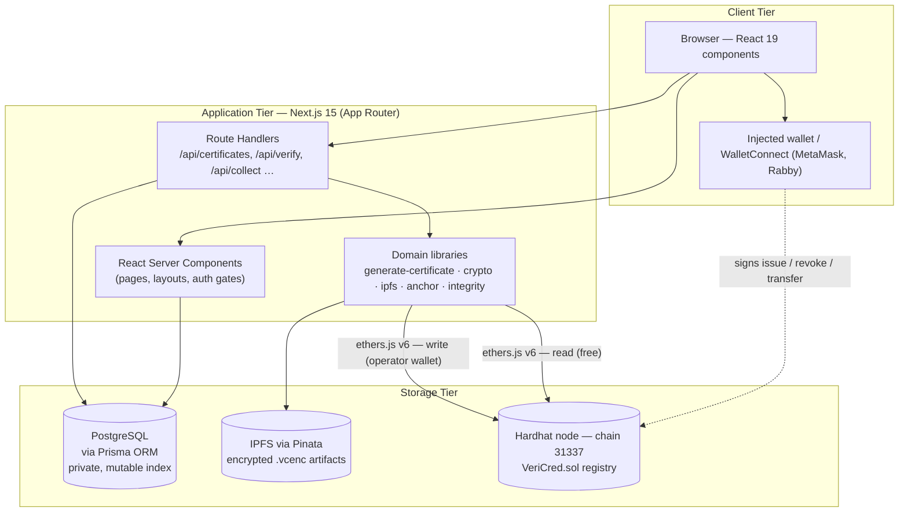
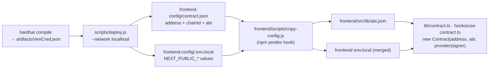
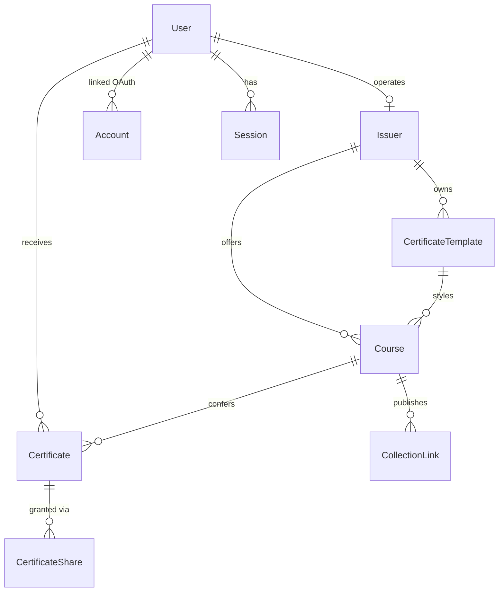
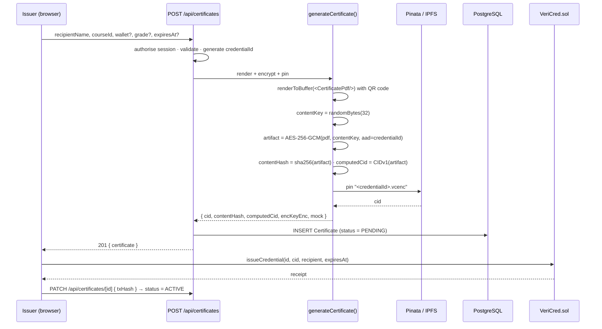
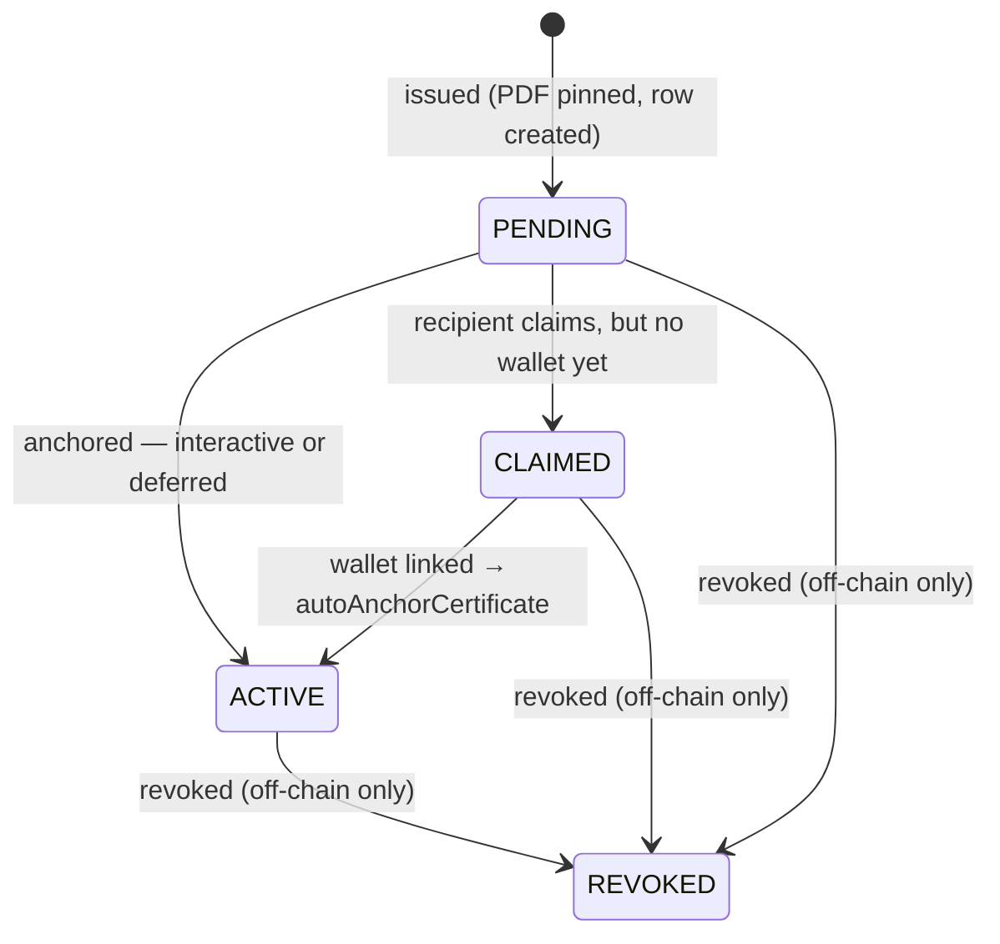

# VeriCred: A Blockchain-Anchored Academic Credential Verification System

## Part 2 — Solution Implementation Report

**Module:** CT124-3-3-BCD — Blockchain Development
**Institution:** Asia Pacific University of Technology and Innovation
**Group:** 14
**Industry sector addressed:** Legal and Intellectual Property (academic credentialing as a proof-of-award instrument)
**Repository:** `vericred/` — Solidity smart contract, Hardhat toolchain, Next.js 15 application, PostgreSQL database
**Licence:** MIT

---

## Abstract

This report documents the design and implementation of VeriCred, a decentralised application (DApp) that anchors academic credentials to a blockchain in order to make them independently and instantly verifiable. The system implements a hybrid storage model: the certificate document is rendered, encrypted, and pinned to the InterPlanetary File System (IPFS), while only the resulting content identifier (CID) — together with the minimum lifecycle metadata required to establish authenticity — is written to an Ethereum-compatible ledger. Personally identifying information is retained in an off-chain relational index and never published to the permanent ledger.

The deliverable comprises a Solidity smart contract (`VeriCred.sol`, 484 lines) exercised by 64 Hardhat unit tests, a PostgreSQL schema of ten entities managed through Prisma across eight versioned migrations, and a Next.js 15 application of 22 pages and 36 HTTP route handlers exercised by 214 integration and unit tests. All 278 tests pass. This document explains how the system is provisioned and executed, describes each implemented feature, and presents annotated code extracts from the three layers required by the assignment brief: the Solidity contract, the relational database, and the front end.

---

## Table of Contents

1. [Introduction](#1-introduction)
2. [System Architecture](#2-system-architecture)
3. [System Setup and Execution](#3-system-setup-and-execution)
4. [Smart Contract Implementation (Solidity)](#4-smart-contract-implementation-solidity)
5. [Database Layer (PostgreSQL and Prisma)](#5-database-layer-postgresql-and-prisma)
6. [Front-End Implementation (Next.js and React)](#6-front-end-implementation-nextjs-and-react)
7. [Feature Implementation Walkthroughs](#7-feature-implementation-walkthroughs)
8. [Testing and Validation](#8-testing-and-validation)
9. [Discussion, Limitations, and Deviations](#9-discussion-limitations-and-deviations)
10. [Conclusion](#10-conclusion)
11. [References](#11-references)
12. [Appendices](#12-appendices)

---

## 1. Introduction

### 1.1 Background and Problem Statement

The verification of academic credentials remains a manual, high-latency, and low-assurance process. An employer presented with a degree certificate has three options: accept the document at face value, contact the issuing institution and wait for a human response, or subscribe to a proprietary verification intermediary. The first is unsafe, the second does not scale, and the third reintroduces precisely the centralised trust anchor that the verification is meant to eliminate.

Two structural weaknesses underlie this situation. First, a certificate presented as a portable document is trivially forgeable; the artefact carries no cryptographic binding to the institution that supposedly issued it. Second, the institutional database of record is mutable and centrally controlled. Where records can be silently amended — through compromise, coercion, or administrative error — an authoritative answer from the issuer is only as trustworthy as the issuer's internal controls at the moment of the enquiry.

Blockchain technology addresses the second weakness directly. A public ledger provides append-only, replicated, and independently auditable storage in which a record, once written, cannot be retroactively altered by the party that wrote it. The engineering problem is therefore not whether to use a ledger but *what* to place on it, given that a public ledger is permanent, world-readable, and consequently an unsuitable home for personal data.

### 1.2 Aim and Objectives

The aim of the project is to construct a working DApp in which the authenticity of an academic credential can be established by any third party, without an account, without a wallet, and without contacting the issuing institution.

The supporting objectives are as follows:

1. To design and implement a Solidity smart contract that anchors credential fingerprints and lifecycle state while excluding personal data from the ledger entirely.
2. To implement a relational off-chain index holding the descriptive and personal data that the contract deliberately omits.
3. To implement a web front end, built with Next.js and React, that connects both to the relational database and to the deployed smart contract, and that serves four distinct user roles.
4. To deploy the contract to a local Hardhat node and demonstrate the complete issuance-to-verification lifecycle against it.
5. To validate the implementation through automated testing at both the contract and the application layer.

### 1.3 Scope of the Deliverable

The assignment brief for Part 2 requires a documented implementation demonstrating the ability to build a front end using Next.js and React, to link that front end to a local database, to deploy a Solidity contract to a Hardhat node, and to link the front end to that contract. Table 1.1 maps each requirement to the sections of this report in which the corresponding implementation is evidenced.

**Table 1.1 — Mapping of assignment requirements to report sections**

| Brief requirement (§2.1) | Implemented as | Evidence |
|---|---|---|
| Build front end using Next.js, React | Next.js 15 App Router application, React 19, TypeScript; 22 pages, 36 route handlers | §6 |
| Link front end to a local database | PostgreSQL accessed via Prisma ORM; 10 models, 8 migrations | §5 |
| Deploy the Solidity contract to a Hardhat node | `scripts/deploy.js` targeting `--network localhost` (chain ID 31337) | §3.4, §4.10 |
| Link front end to the Solidity contract | `lib/contract.ts` (server), `hooks/use-contract.ts` (client), ethers.js v6 | §6.4 |
| Explain how to set up the system | Complete provisioning procedure | §3 |
| Explain system features | Feature-by-feature walkthrough with code | §7 |

### 1.4 Structure of this Document

Section 2 presents the system architecture and justifies the hybrid storage model. Section 3 provides the complete setup procedure. Sections 4, 5, and 6 document the three implementation layers in turn, each with annotated code extracts. Section 7 traces the principal features end-to-end across those layers. Section 8 reports the testing strategy and results. Section 9 discusses limitations and identifies where the implementation deliberately departs from the Part 1 proposal. Section 10 concludes.

---

## 2. System Architecture

### 2.1 Architectural Overview

VeriCred is organised into four cooperating tiers. The presentation and application tiers are co-located within a single Next.js deployment, which executes both React Server Components and HTTP route handlers; the storage tier is split between a private relational database and two public, content-addressed or ledger-based stores.



**Figure 2.1 — Tiered system architecture.**

Two observations about this topology are material to the design. First, the ledger is written from two distinct positions: from the client, where an institution signs a transaction with its own connected wallet, and from the server, where a platform-custodied *operator wallet* signs on the institution's behalf when no member of that institution is present in the request (§7.2). Second, ledger *reads* require no wallet and no signature whatsoever, which is what permits the public verification endpoint to operate for anonymous visitors.

### 2.2 The Hybrid Storage Model

The central design decision is the partitioning of credential data across three stores. The allocation is summarised in Table 2.1.

**Table 2.1 — Allocation of credential data across storage tiers**

| Data | Store | Justification |
|---|---|---|
| Issuer wallet address, recipient wallet address | Blockchain | Pseudonymous identifiers; required to attribute and address the award |
| IPFS CID of the encrypted certificate | Blockchain | The integrity fingerprint; must be immutable to be probative |
| Issued, revoked, and expiry timestamps; revocation flag and reason | Blockchain | Lifecycle state that a verifier must be able to trust without the issuer |
| Encrypted certificate document (ciphertext) | IPFS | Content-addressed, replicated, retrievable by anyone holding the CID |
| Recipient name, e-mail address, grade, course description, template layout | PostgreSQL | Personal and descriptive data; must remain mutable and erasable |
| Accounts, sessions, collection links, share grants | PostgreSQL | Application state with no evidentiary function |

The justification for excluding personal data from the ledger is stated in the contract's own header comment and is worth restating because it governs every subsequent decision:

```solidity
 * @dev    DESIGN RULE — no personal data on-chain.
 *
 *         The certificate file is encrypted off-chain and pinned to IPFS.
 *         Only its CID is written here. Because an IPFS CID is a multihash of
 *         the file's own bytes, the CID *is* the integrity fingerprint: change
 *         one byte of the certificate and it hashes to a different CID, which
 *         no longer matches what was anchored. No separate "certificate hash"
 *         field is needed, and none is stored.
```
*Extract 2.1 — `contracts/VeriCred.sol`, lines 9–16.*

The property being exploited is that an IPFS CID is not an arbitrary identifier but a multihash computed over the file's own bytes (Benet, 2014). A single-bit modification to the certificate produces a different CID, which no longer matches the value anchored on the ledger. The CID therefore serves simultaneously as the retrieval address and as the tamper-evidence seal, and no separate hash field is required.

The consequence for privacy is that the ledger contains nothing that identifies a natural person beyond a wallet address, and that a right-to-erasure request can be satisfied against the PostgreSQL index without any attempt to alter — which is to say, without any attempt to do the impossible to — the ledger.

### 2.3 Technology Stack

**Table 2.2 — Implementation technologies**

| Layer | Technology | Version |
|---|---|---|
| Smart contract language | Solidity | ^0.8.24 |
| Contract toolchain | Hardhat, `@nomicfoundation/hardhat-toolbox` | ^2.22.0, ^5.0.0 |
| Contract test framework | Mocha + Chai + Hardhat Network Helpers | via toolbox |
| Blockchain client library | ethers.js | ^6.17.0 |
| Application framework | Next.js (App Router) | ^15.5.22 |
| UI library | React | 19.2.4 |
| Language | TypeScript | ^5 |
| Styling | Tailwind CSS, shadcn/ui, lucide-react | ^4, ^4.16.0, ^1.27.0 |
| Database | PostgreSQL | 14+ |
| ORM and migration tool | Prisma | ^6.19.3 |
| Authentication | Auth.js (NextAuth) v5, SIWE, bcrypt | ^5.0.0-beta.25, ^3.0.0, ^6.0.0 |
| Wallet connectivity | Reown AppKit (WalletConnect) | ^1.8.23 |
| Document rendering | `@react-pdf/renderer`; satori via `next/og` | ^4.4.0 |
| IPFS pinning | Pinata pinning API | HTTP |
| Content addressing | `multiformats`, `ipfs-unixfs-importer` | ^14.0.5, ^17.0.1 |
| Transactional e-mail | SendGrid | ^8.1.6 |
| Application test framework | Vitest | ^3.2.4 |

### 2.4 Repository Organisation

```text
vericred/
├── contracts/VeriCred.sol          Solidity registry contract (^0.8.24)
├── test/VeriCred.test.js           64 Hardhat unit tests
├── scripts/
│   ├── deploy.js                   Deploys, authorises registry, exports ABI + address
│   ├── seed.js                     Seeds four demonstration credentials, revokes one
│   └── wait-for-node.js            Polls JSON-RPC until the node is ready
├── hardhat.config.js               Solidity 0.8.24, optimiser at 200 runs, localhost network
├── frontend-config/                Deployment artefacts consumed by the front end
│   ├── contract.json               { address, chainId, deployedAt, abi }
│   └── .env.local                  NEXT_PUBLIC_* contract variables
└── frontend/
    ├── prisma/
    │   ├── schema.prisma           10 models, 3 enumerations
    │   ├── migrations/             8 versioned migrations
    │   └── seed.ts                 Administrator and issuer demonstration accounts
    ├── scripts/copy-config.js      Copies ABI and env vars into the application
    └── src/
        ├── app/                    App Router: 22 pages and 36 route handlers
        ├── components/             React components (UI, credentials, issuer, admin)
        ├── lib/                    Domain libraries (contract, crypto, ipfs, anchor …)
        ├── hooks/                  Client hooks (use-contract, use-wallet-proof …)
        └── providers/              Web3 and AppKit provider boundaries
```

---

## 3. System Setup and Execution

This section constitutes the setup documentation required by §2.3 of the assignment brief. The procedure assumes a clean checkout with `node_modules` removed.

### 3.1 Prerequisites

| Requirement | Minimum version | Purpose |
|---|---|---|
| Node.js | 18.18.0 | Required by Next.js 15 |
| npm | 9 | Dependency management |
| PostgreSQL | 14 | Off-chain relational index |
| MetaMask (or compatible wallet) | current | Signing on-chain transactions |
| Visual Studio Code | current | Development environment (per brief §2.2) |

### 3.2 Dependency Installation

Two dependency trees exist and must both be installed. The root tree carries the Hardhat toolchain; the `frontend/` tree carries the application.

```bash
# From the repository root — Hardhat toolchain
npm install

# Application dependencies
cd frontend
npm install
cd ..
```

### 3.3 Compiling and Testing the Contract

```bash
npm run compile      # hardhat compile — emits artifacts/ and cache/
npm run test         # hardhat test — expect "64 passing"
```

Successful compilation confirms that the Solidity 0.8.24 compiler and the optimiser configuration declared in `hardhat.config.js` are operational:

```javascript
module.exports = {
  solidity: {
    version: "0.8.24",
    settings: {
      optimizer: { enabled: true, runs: 200 },
    },
  },
  networks: {
    hardhat:   { chainId: 31337 },
    localhost: { url: "http://127.0.0.1:8545", chainId: 31337 },
  },
};
```
*Extract 3.1 — `hardhat.config.js`.*

### 3.4 Starting the Local Blockchain and Deploying

The local Hardhat node is started in one terminal and the deployment executed against it from another.

```bash
# Terminal 1 — local blockchain at http://127.0.0.1:8545
npm run node

# Terminal 2 — deploy and seed demonstration credentials
npm run deploy       # hardhat run scripts/deploy.js --network localhost
npm run seed         # hardhat run scripts/seed.js --network localhost
```

The deployment script performs three tasks beyond deploying the bytecode. It authorises a second signer as a distinct issuing institution so that the demonstration does not run everything from the administrator account; it writes the contract address, chain identifier, and ABI to `frontend-config/contract.json`; and it writes a convenience environment file. The export step is reproduced below, because it is the mechanism by which the contract and the front end are linked.

```javascript
// Authorise a second signer as the Academic Registry, so the demo has a
// distinct issuer wallet rather than everything running from the admin.
const signers = await ethers.getSigners();
if (signers[1]) {
  await (await vericred.authoriseInstitution(signers[1].address)).wait();
  console.log("Registry authorised :", signers[1].address);
}

// ── Export address + ABI for the frontend ──────────────────────
const { abi } = await artifacts.readArtifact("VeriCred");
const outDir = path.join(__dirname, "..", "frontend-config");
fs.mkdirSync(outDir, { recursive: true });

fs.writeFileSync(
  path.join(outDir, "contract.json"),
  JSON.stringify(
    { address, chainId: network.config.chainId, deployedAt: new Date().toISOString(), abi },
    null, 2
  )
);
```
*Extract 3.2 — `scripts/deploy.js`.*

### 3.5 The Configuration Propagation Pipeline

Linking the front end to the contract is automated rather than manual, which removes an entire class of configuration error in which the application is compiled against a stale ABI or a previous deployment address. The pipeline is illustrated in Figure 3.1.



**Figure 3.1 — Contract-to-front-end configuration pipeline.**

The copying step is registered as an npm `predev` hook, so it executes automatically before every development server start:

```json
"scripts": {
  "predev": "node scripts/copy-config.js",
  "dev": "next dev --turbopack",
  ...
}
```
*Extract 3.3 — `frontend/package.json`.*

The script is deliberately written to no-op rather than throw when the contract has not yet been deployed, so that a fresh checkout can still start the development server; correspondingly, `lib/contract.ts` guards the ABI import and raises a descriptive error only at the point of use (Extract 6.4).

### 3.6 Provisioning the Database

A PostgreSQL database must exist before migrations are applied. The connection string is supplied through `DATABASE_URL`.

```bash
# Create the database (psql, or any client)
createdb vericred

cd frontend
npx prisma migrate dev     # applies all 8 migrations and generates the client
npx prisma db seed         # creates the demonstration Admin and Issuer accounts
```

`prisma migrate dev` applies the eight migrations listed in Table 5.2 in order and regenerates the type-safe Prisma client from `schema.prisma`.

### 3.7 Environment Configuration

The application is configured through `frontend/.env.local`. Variables marked *auto* are written by the pipeline of §3.5 and need not be set by hand.

**Table 3.1 — Environment variables**

| Variable | Required | Purpose |
|---|---|---|
| `NEXT_PUBLIC_CONTRACT_ADDRESS` | yes *(auto)* | Deployed `VeriCred` address |
| `NEXT_PUBLIC_CHAIN_ID` | yes *(auto)* | `31337` for the local Hardhat network |
| `NEXT_PUBLIC_RPC_URL` | yes *(auto)* | `http://127.0.0.1:8545` |
| `NEXT_PUBLIC_BLOCK_EXPLORER_URL` | no | Explorer base URL; omitted locally, as no explorer exists for chain 31337 |
| `DATABASE_URL` | yes | PostgreSQL connection string |
| `NEXTAUTH_SECRET`, `NEXTAUTH_URL` | yes | Auth.js session signing and base URL |
| `ENCRYPTION_KEY` | yes | 32 bytes, hex-encoded. Wraps per-certificate content keys and operator wallet private keys at rest (§7.1) |
| `ADMIN_PRIVATE_KEY` | no | Enables server-side signing of `authoriseInstitution` / `removeInstitution` |
| `PINATA_API_KEY`, `PINATA_SECRET_KEY` | no | IPFS pinning. Without them a clearly marked mock CID is produced, which the system refuses to use in production |
| `NEXT_PUBLIC_WALLETCONNECT_PROJECT_ID` | no | WalletConnect Cloud project identifier |
| `GITHUB_ID` / `GITHUB_SECRET` | no | GitHub OAuth |
| `GOOGLE_CLIENT_ID` / `GOOGLE_CLIENT_SECRET` | no | Google OAuth |
| `LINKEDIN_CLIENT_ID` / `LINKEDIN_CLIENT_SECRET` | no | LinkedIn OAuth |
| `SENDGRID_API_KEY`, `SENDGRID_FROM_EMAIL` | no in development | Transactional e-mail; throws in production if unset rather than silently reporting success |

`ENCRYPTION_KEY` is generated as follows:

```bash
node -e "console.log(require('crypto').randomBytes(32).toString('hex'))"
```

The loss of this key renders every previously issued certificate artefact permanently undecryptable; it is therefore treated as a backup-critical secret.

### 3.8 Running the Application

```bash
cd frontend
npm run dev            # predev copies config; Next.js starts on :3000
```

The application is then available at `http://localhost:3000`.

For convenience, the repository root provides orchestrated alternatives that run the blockchain and the application together using `concurrently`:

```bash
npm run dev            # Hardhat node + front end in parallel (assumes a prior deploy)
npm run dev:fresh      # Cold start: node → wait-for-node → deploy → seed → front end
```

The two are distinct because `dev:fresh` must be *chained* rather than parallel: the front end's `predev` hook copies `frontend-config/`, which only exists once `deploy` has run.

### 3.9 Wallet Configuration

To exercise on-chain issuance interactively, MetaMask is configured with a custom network — RPC URL `http://127.0.0.1:8545`, chain identifier `31337` — and one of Hardhat's deterministic test accounts is imported.

| Role in the demonstration | Private key |
|---|---|
| Administrator (Account #0) | `0xac0974bec39a17e36ba4a6b4d238ff944bacb478cbed5efcae784d7bf4f2ff80` |
| Academic Registry (Account #1) | `0x59c6995e998f97a5a0044966f0945389dc9e86dae88c7a8412f4603b6b78690d` |

These are Hardhat's publicly documented development keys. They are safe only on a local chain and must never be used on a public network.

### 3.10 Demonstration Accounts

`npx prisma db seed` provisions the two privileged accounts required to demonstrate the issuer and administrator interfaces. No self-service route to either role exists in the application, by design (§9.2).

| Role | E-mail | Password |
|---|---|---|
| Administrator | `admin@vericred.local` | `Admin@12345` |
| Issuer (Asia Pacific University) | `issuer@apu.edu.my` | `Issuer@12345` |

Both are e-mail-and-password accounts without an associated login wallet. The seed script matches strictly on its own dedicated e-mail addresses and is idempotent, so repeated execution updates the same two rows rather than creating duplicates or overwriting an account created by a real sign-in.

### 3.11 Verifying the Installation

```bash
npm run test               # root: 64 contract tests
cd frontend && npm run test # 214 application tests (requires a local PostgreSQL test database)
```

---

## 4. Smart Contract Implementation (Solidity)

### 4.1 Design Principles

`contracts/VeriCred.sol` is a registry contract, not a token contract. It records that a given credential identifier was anchored by a given institution to a given fingerprint at a given time, and it records any subsequent change in that credential's lifecycle state. Five principles govern its construction.

1. **No personal data is written to the ledger.** Only wallet addresses, the IPFS CID, and lifecycle metadata are stored (Extract 2.1).
2. **A credential identifier may be anchored exactly once.** Permitting an overwrite would allow an institution to substitute the file behind an identifier that an employer had already verified, which would defeat the purpose of anchoring anything.
3. **Revocation is append-only.** Revoking sets a flag and records a reason; it never deletes the issuance record, and the original `CredentialIssued` event remains on the ledger permanently.
4. **Existence and validity are separate concerns.** A forged certificate that was never anchored and a genuine certificate that was subsequently withdrawn are materially different situations, and a verifier must be able to distinguish them.
5. **Verification is free.** All read paths are `view` functions callable by any party without gas, an account, or a wallet.

### 4.2 On-Chain Data Model

```solidity
/**
 * @dev Storage layout is packed deliberately.
 *      issuer (20 bytes) + issuedAt (5) + revokedAt (5) + revoked (1)
 *      = 31 bytes, so these four fields share a single 32-byte slot.
 *      recipient (20 bytes) + expiresAt (5) = 25 bytes share the next slot.
 *      uint40 holds unix seconds until the year 36812, which is ample.
 */
struct Credential {
    address issuer;           // institution wallet that anchored it
    uint40  issuedAt;         // block timestamp at issuance
    uint40  revokedAt;        // 0 while the credential still stands
    bool    revoked;          // status flag — never a deletion
    address recipient;        // wallet the credential currently belongs to
    uint40  expiresAt;        // 0 = no expiry, else unix seconds
    string  cid;              // IPFS CID: the integrity fingerprint
    string  credentialId;     // human-readable, e.g. "VC-2026-0001"
    string  revocationReason; // published with the revocation
}
```
*Extract 4.1 — `contracts/VeriCred.sol`, lines 31–48.*

The field ordering is not incidental. The Ethereum Virtual Machine addresses storage in 32-byte words (Wood, 2014), and the Solidity compiler packs consecutive fields into a single word where their combined width permits (Ethereum Foundation, 2024). Declaring `issuer`, `issuedAt`, `revokedAt`, and `revoked` consecutively yields 20 + 5 + 5 + 1 = 31 bytes, which occupies one slot rather than four. `recipient` and `expiresAt` occupy 25 bytes of the next. Timestamps use `uint40` rather than `uint256` specifically to make this packing possible; the type accommodates Unix seconds until the year 36812, so no practical range is sacrificed.

Storage is keyed by the keccak256 hash of the human-readable identifier, which yields fixed-size keys:

```solidity
address public admin;

/// @notice Wallets permitted to issue credentials.
mapping(address => bool) public isInstitution;

/// @dev keccak256(credentialId) => record. Hashing gives fixed-size keys.
mapping(bytes32 => Credential) private _credentials;

/// @dev Enumeration support, so a frontend can list every record.
bytes32[] private _index;

/// @dev Enumeration support per recipient, so a frontend can list a
///      wallet's credentials without scanning the whole registry.
mapping(address => bytes32[]) private _recipientCredentials;
mapping(bytes32 => uint256)   private _recipientIndex;
```
*Extract 4.2 — `contracts/VeriCred.sol`, lines 54–68.*

Because Solidity mappings are not enumerable, the contract maintains two auxiliary index structures: a global array of identifier hashes and a per-recipient array with a companion position map. The position map is what allows a credential to be removed from a recipient's list in constant time during a transfer (§4.7).

### 4.3 Events as the Permanent Audit Trail

```solidity
/**
 * @dev `credentialId` is emitted twice on purpose: the indexed bytes32
 *      hash makes the event efficiently filterable, while the plain
 *      string keeps the log human-readable in a block explorer.
 */
event CredentialIssued(
    bytes32 indexed idHash,
    address indexed issuer,
    address indexed recipient,
    string  credentialId,
    string  cid,
    uint256 issuedAt,
    uint40  expiresAt
);

event CredentialRevoked(
    bytes32 indexed idHash,
    address indexed revokedBy,
    string  credentialId,
    string  reason,
    uint256 revokedAt
);

event CredentialTransferred(
    bytes32 indexed idHash,
    address indexed from,
    address indexed to,
    string  credentialId
);
```
*Extract 4.3 — `contracts/VeriCred.sol`, lines 74–102.*

Events serve two functions here. They are the cheapest available form of on-chain record, costing markedly less than an equivalent state write (though, unlike storage, they cannot be read back by the contract itself), and they are permanent: even if the contract's mutable state were later changed, the historical log of what was issued and when cannot be. The three indexed parameters per event — the maximum Solidity permits for a non-anonymous event — allow a client to filter the log by credential, by issuing institution, or by recipient wallet without retrieving and scanning the full history.

### 4.4 Access Control

The contract implements a three-tier authority model using modifiers and custom errors.

```solidity
error NotAdmin();
error NotAuthorisedInstitution();
error NotIssuerOrAdmin();
error CredentialAlreadyExists(string credentialId);
error CredentialNotFound(string credentialId);
error CredentialAlreadyRevoked(string credentialId);
error EmptyCredentialId();
error EmptyCid();
error EmptyReason();
error ZeroAddress();
error LengthMismatch();
error NotRecipientOrAdmin();
error SelfTransfer();
error InvalidExpiryDate();
error ZeroRecipient();

modifier onlyAdmin() {
    if (msg.sender != admin) revert NotAdmin();
    _;
}

modifier onlyInstitution() {
    if (!isInstitution[msg.sender]) revert NotAuthorisedInstitution();
    _;
}
```
*Extract 4.4 — `contracts/VeriCred.sol`, lines 112–140.*

Fifteen custom errors are declared in place of `require` strings. Since Solidity 0.8.4, custom errors encode as a four-byte selector plus ABI-encoded arguments, which is substantially cheaper in both deployment and revert-path gas than storing a revert string in bytecode (Ethereum Foundation, 2024). They also give the front end a recoverable failure mode: `lib/errors.ts` maps each error back to a human-readable message, so a user who attempts to issue a duplicate identifier is told exactly that rather than being shown a generic transaction failure. The mechanism is worth stating precisely, because it is weaker than it could be — `parseContractError` collects candidate strings from the thrown error (`shortMessage`, `reason`, `message`, `info.error.message`, `data`) and **substring-matches the custom error's name** against a hard-coded table. It does not decode the four-byte selector from the ABI. This is adequate in practice but brittle, since it depends on ethers continuing to surface the error name in one of those fields, and is a candidate for hardening.

The constructor makes the deployer both administrator and the first authorised institution, so that a freshly deployed contract is immediately usable:

```solidity
constructor() {
    admin = msg.sender;
    isInstitution[msg.sender] = true;
    emit AdminTransferred(address(0), msg.sender);
    emit InstitutionAuthorised(msg.sender, msg.sender);
}
```
*Extract 4.5 — `contracts/VeriCred.sol`, lines 148–153.*

A subtle but consequential rule governs the removal of an institution:

```solidity
/**
 * @notice Removes an institution's ability to issue new credentials.
 * @dev    Credentials it already anchored remain valid. Losing the right
 *         to issue in future is not the same as your past awards being
 *         void, and the contract must not conflate the two.
 */
function removeInstitution(address institution) external onlyAdmin {
    isInstitution[institution] = false;
    emit InstitutionRemoved(institution, msg.sender);
}
```
*Extract 4.6 — `contracts/VeriCred.sol`, lines 165–174.*

A university that loses its accreditation, or is removed from the platform for administrative reasons, has not thereby un-awarded the degrees it previously conferred. Test case *"leaves already-issued credentials valid after an institution is removed"* asserts precisely this: after removal the institution's next `issueCredential` call reverts with `NotAuthorisedInstitution`, while `isValid` on its previously anchored credential still returns `true`.

### 4.5 Issuance

```solidity
function issueCredential(
    string calldata credentialId,
    string calldata cid,
    address recipient,
    uint40 expiresAt
)
    external
    onlyInstitution
{
    if (bytes(credentialId).length == 0) revert EmptyCredentialId();
    if (bytes(cid).length == 0) revert EmptyCid();
    if (recipient == address(0)) revert ZeroRecipient();
    if (expiresAt != 0 && expiresAt <= uint40(block.timestamp)) revert InvalidExpiryDate();

    bytes32 idHash = keccak256(bytes(credentialId));
    if (_exists(idHash)) revert CredentialAlreadyExists(credentialId);

    _credentials[idHash] = Credential({
        issuer:           msg.sender,
        issuedAt:         uint40(block.timestamp),
        revokedAt:        0,
        revoked:          false,
        recipient:        recipient,
        expiresAt:        expiresAt,
        cid:              cid,
        credentialId:     credentialId,
        revocationReason: ""
    });
    _index.push(idHash);
    _recipientCredentials[recipient].push(idHash);
    _recipientIndex[idHash] = _recipientCredentials[recipient].length - 1;

    emit CredentialIssued(idHash, msg.sender, recipient, credentialId, cid, block.timestamp, expiresAt);
}
```
*Extract 4.7 — `contracts/VeriCred.sol`, lines 200–233.*

Four preconditions are enforced before any state is written. (This is input validation rather than the checks-effects-interactions pattern proper, which concerns external calls; `issueCredential` makes none.) The existence check is the mechanism enforcing design principle 2: a credential identifier can be anchored exactly once, and any attempt to re-anchor reverts with the offending identifier included in the error payload.

Existence itself is determined by a non-empty CID rather than by a separate boolean flag:

```solidity
/// @dev A non-empty CID is the existence marker — every issued record has
///      one, and issueCredential rejects an empty CID.
function _exists(bytes32 idHash) private view returns (bool) {
    return bytes(_credentials[idHash].cid).length != 0;
}
```
*Extract 4.8 — `contracts/VeriCred.sol`, lines 479–483.*

This saves a storage slot and cannot desynchronise from reality, because `issueCredential` rejects an empty CID as its second precondition.

**Batch issuance.** Graduation is inherently a batch event: an entire cohort is conferred on the same day. The contract therefore provides a batch entry point whose economic justification is documented inline:

```solidity
/**
 * @notice Anchors many credentials in one transaction.
 * @dev    Graduation is a batch event — a whole cohort is conferred on the
 *         same day. One transaction for 200 graduates pays the ~21,000 gas
 *         base cost once instead of 200 times.
 */
function issueCredentialBatch(
    string[] calldata credentialIds,
    string[] calldata cids,
    address[] calldata recipients,
    uint40[] calldata expiresAts
) external onlyInstitution {
    uint256 n = credentialIds.length;
    if (n != cids.length || n != recipients.length || n != expiresAts.length) revert LengthMismatch();

    for (uint256 i = 0; i < n; ++i) {
        // … identical per-item validation and state write as issueCredential …
    }
}
```
*Extract 4.9 — `contracts/VeriCred.sol`, lines 235–281 (abridged).*

Three implementation details merit comment. The parameters are declared `calldata` rather than `memory`, so array elements are read directly from transaction input without being copied into memory. The loop uses pre-increment `++i`; it should be noted that at the optimiser setting this project configures (200 runs) solc discards the unused post-increment result and emits identical bytecode, so this is a stylistic choice rather than a measurable saving — and that the loop is *not* wrapped in `unchecked { ++i }`, which is the optimisation that would genuinely survive, at roughly 30–40 gas per iteration. And the length check is performed once across all four arrays before the loop begins, so a malformed call fails on its first instruction rather than consuming gas across a partial pass. (State consistency is not at stake: a revert unwinds every write regardless of where it occurs.)

**Measured rather than asserted.** Against the deployed contract, a fifty-item `issueCredentialBatch` consumed 10,701,988 gas — 214,039 per credential — against 245,814 for a single `issueCredential`, a saving of approximately **13%**. Two qualifications follow directly from the measurement and should not be omitted. The dominant cost is per-credential storage rather than the transaction base fee, so the saving is real but modest. And the comment's own example of two hundred graduates in one transaction would require roughly 42.8M gas, **exceeding Ethereum's approximately 30M block gas limit**; the application's hundred-row cap already implies some 21M gas, over half a block. Batch size therefore has a hard ceiling that the design must respect.

### 4.6 Revocation

```solidity
/**
 * @notice Withdraws a credential. Callable by the issuing institution or
 *         the admin.
 * @dev    This APPENDS a status change. The Credential struct, its CID and
 *         the original CredentialIssued event all survive untouched, so
 *         the history of the award remains auditable forever. A reason is
 *         mandatory because it is published to the permanent audit trail.
 */
function revokeCredential(string calldata credentialId, string calldata reason)
    external
{
    if (bytes(reason).length == 0) revert EmptyReason();

    bytes32 idHash = keccak256(bytes(credentialId));
    if (!_exists(idHash)) revert CredentialNotFound(credentialId);

    Credential storage c = _credentials[idHash];
    if (c.revoked) revert CredentialAlreadyRevoked(credentialId);
    if (msg.sender != c.issuer && msg.sender != admin) revert NotIssuerOrAdmin();

    c.revoked          = true;
    c.revokedAt        = uint40(block.timestamp);
    c.revocationReason = reason;

    emit CredentialRevoked(idHash, msg.sender, credentialId, reason, block.timestamp);
}
```
*Extract 4.10 — `contracts/VeriCred.sol`, lines 287–312.*

The authorisation check is positioned *after* the existence and already-revoked checks, so that the most specific diagnostic is returned first: a caller attempting to revoke a nonexistent credential receives `CredentialNotFound` rather than the less informative `NotIssuerOrAdmin`.

It should be noted that this ordering does make the revert channel distinguish existing from nonexistent identifiers for an unauthorised caller. That is not a disclosure concern here, because `verifyCredential` is already public and free — anyone may establish the same fact directly, at no cost and without a transaction. Were existence not already public, the checks would need to be ordered the other way round.

The mandatory reason is an accountability mechanism rather than a data-quality one. Because the reason is published to a permanent, world-readable log, an institution cannot quietly withdraw an award; the withdrawal and its stated grounds become part of the same immutable record as the original conferral.

### 4.7 Transfer and Wallet Migration

Recipients lose access to wallets. The contract therefore permits a credential to be reassigned, with the interesting complexity residing in maintaining the per-recipient index:

```solidity
function transferCredential(string calldata credentialId, address newRecipient) external {
    if (newRecipient == address(0)) revert ZeroRecipient();

    bytes32 idHash = keccak256(bytes(credentialId));
    if (!_exists(idHash)) revert CredentialNotFound(credentialId);

    Credential storage c = _credentials[idHash];
    address oldRecipient = c.recipient;
    if (msg.sender != oldRecipient && msg.sender != admin) revert NotRecipientOrAdmin();
    if (newRecipient == oldRecipient) revert SelfTransfer();

    c.recipient = newRecipient;

    bytes32[] storage oldList = _recipientCredentials[oldRecipient];
    uint256 idx = _recipientIndex[idHash];
    uint256 lastIdx = oldList.length - 1;
    if (idx != lastIdx) {
        bytes32 lastHash = oldList[lastIdx];
        oldList[idx] = lastHash;
        _recipientIndex[lastHash] = idx;
    }
    oldList.pop();

    _recipientCredentials[newRecipient].push(idHash);
    _recipientIndex[idHash] = _recipientCredentials[newRecipient].length - 1;

    emit CredentialTransferred(idHash, oldRecipient, newRecipient, credentialId);
}
```
*Extract 4.11 — `contracts/VeriCred.sol`, lines 324–351.*

The removal employs the *swap-and-pop* idiom: the final element of the old recipient's array is moved into the vacated position, the companion position map is updated for the moved element, and the array is shortened. This achieves O(1) removal where a naïve shift would be O(n) — an important distinction when a single wallet may hold many credentials. Two dedicated tests cover this path, including the non-trivial case in which the removed element is not the last (*"correctly maintains recipient list when transferring a non-last credential (swap-and-pop)"*).

Revoked and expired credentials remain transferable by design: the transfer concerns custody of the record, not its validity, and a holder is entitled to move a withdrawn credential to a new wallet along with the rest of their history.

### 4.8 Verification

```solidity
/**
 * @notice Verifies a credential. Callable by anyone, costs no gas.
 * @dev    `exists` and `valid` are returned separately on purpose. A forged
 *         certificate (never anchored) and a genuine but withdrawn one are
 *         different situations, and an employer needs to tell them apart.
 */
function verifyCredential(string calldata credentialId)
    external
    view
    returns (
        bool    exists,
        bool    valid,
        string memory cid,
        address issuer,
        uint256 issuedAt,
        address recipient,
        uint40  expiresAt
    )
{
    bytes32 idHash = keccak256(bytes(credentialId));
    Credential storage c = _credentials[idHash];

    exists = bytes(c.cid).length != 0;
    if (!exists) {
        return (false, false, "", address(0), 0, address(0), 0);
    }
    bool notExpired = c.expiresAt == 0 || block.timestamp <= uint256(c.expiresAt);
    return (true, !c.revoked && notExpired, c.cid, c.issuer, uint256(c.issuedAt), c.recipient, c.expiresAt);
}
```
*Extract 4.12 — `contracts/VeriCred.sol`, lines 357–396.*

The function is declared `view` and is therefore executed locally by the querying node without a transaction, without gas, and without any signature. This is the technical basis for the claim that verification is free and open to the public: an employer requires neither an account with VeriCred nor a cryptocurrency wallet in order to establish that a credential is genuine.

The separation of `exists` from `valid` yields four distinguishable outcomes, which the front end renders as four distinct verification results (§7.3):

**Table 4.1 — Verification outcome semantics**

| `exists` | `valid` | Interpretation | User-facing result |
|---|---|---|---|
| `false` | `false` | Never anchored — probable forgery | Not Found (red) |
| `true` | `true` | Anchored, not revoked, not expired | Valid (green) |
| `true` | `false` (revoked) | Genuinely issued, subsequently withdrawn | Revoked (amber), with reason |
| `true` | `false` (past `expiresAt`) | Genuinely issued, term elapsed | Expired (grey) |

Two convenience readers accompany it: `getCredential` returns the full struct including the revocation reason, and `isValid` returns a single boolean for a status badge.

### 4.9 Enumeration and Pagination

```solidity
/**
 * @notice Page through every anchored credential.
 * @dev    Paginated rather than returning the whole array, which would
 *         eventually exceed the node's gas cap on a large cohort.
 */
function getCredentialsPaged(uint256 offset, uint256 limit)
    external
    view
    returns (Credential[] memory page)
{
    uint256 total = _index.length;
    if (offset >= total) return new Credential[](0);

    uint256 end = offset + limit;
    if (end > total) end = total;

    page = new Credential[](end - offset);
    for (uint256 i = offset; i < end; ++i) {
        page[i - offset] = _credentials[_index[i]];
    }
}
```
*Extract 4.13 — `contracts/VeriCred.sol`, lines 426–446.*

Although `view` functions consume no gas when called externally, nodes nonetheless impose an execution gas cap on `eth_call`. An unpaginated accessor returning the entire registry would function correctly during development and fail once the registry reached a realistic size — a failure mode that appears only in production. Pagination, with an out-of-range offset returning an empty page rather than reverting, avoids this. `getCredentialsByRecipient` applies the same treatment to the per-recipient index.

### 4.10 Gas Economy: Summary of Optimisations

**Table 4.2 — Gas-conscious implementation decisions**

| Technique | Location | Effect |
|---|---|---|
| Struct field packing via `uint40` timestamps | `Credential` (Extract 4.1) | Four fields share one 32-byte slot instead of four |
| Custom errors in place of `require` strings | Extract 4.4 | Smaller bytecode; cheaper revert path |
| `calldata` parameters | All external functions | Avoids memory copies of string and array arguments |
| Pre-increment `++i` in loops | Extracts 4.9, 4.13 | Avoids a temporary copy per iteration |
| Batch issuance | Extract 4.9 | Amortises the ~21,000 gas transaction base cost across a cohort |
| Non-empty CID as existence marker | Extract 4.8 | Eliminates a dedicated boolean storage slot |
| `bytes32` keccak keys | Extract 4.2 | Fixed-size mapping keys instead of variable-length strings |
| Indexed event parameters | Extract 4.3 | Efficient client-side log filtering without full-history scans |
| Optimiser at 200 runs | `hardhat.config.js` | Balances deployment cost against per-call cost |

---

## 5. Database Layer (PostgreSQL and Prisma)

### 5.1 Purpose of the Off-Chain Index

The relational database holds everything the contract deliberately refuses to hold. This comprises three categories: personal data that must not be published permanently (recipient names, e-mail addresses, awarded grades); descriptive data with no evidentiary function (course names and descriptions, template layouts, institutional logotypes); and application state (accounts, sessions, collection links, share grants, verification tokens).

The database is accessed exclusively through Prisma, which provides a declarative schema, versioned migrations, and a generated client whose types are derived from the schema — so that a schema change that invalidates a query is caught at compile time rather than at run time.

### 5.2 Entity Model



**Figure 5.1 — Entity-relationship model (`frontend/prisma/schema.prisma`).**

**Table 5.1 — Model inventory**

| Model | Role |
|---|---|
| `User` | Identity: name, username, e-mail, password hash, wallet address, role |
| `Account`, `Session`, `VerificationToken` | Auth.js adapter tables (OAuth links, sessions, e-mail tokens) |
| `Issuer` | Institution profile: organisation name, on-chain wallet, operator wallet, approval status |
| `CertificateTemplate` | Reusable JSON layout for rendered certificates |
| `Course` | A programme of study; binds an issuer to a template |
| `Certificate` | The off-chain credential record: recipient, CID, transaction hash, status, encryption bookkeeping |
| `CertificateShare` | Revocable grant permitting a third party to open one certificate's document |
| `CollectionLink` | Self-service claim link with collection cap, link expiry, and certificate expiry |

Three enumerations model the state machines: `Role` (`USER`, `ISSUER`, `ADMIN`), `IssuerStatus` (`PENDING`, `APPROVED`, `REJECTED`), and `CertificateStatus`.

### 5.3 The `Certificate` Model

```prisma
model Certificate {
  id               String            @id @default(cuid())
  credentialId     String            @unique
  recipientName    String
  recipientEmail   String?
  recipientId      String?
  recipient        User?             @relation("RecipientCerts", fields: [recipientId], references: [id])
  courseId         String
  course           Course            @relation(fields: [courseId], references: [id])
  cid              String?
  txHash           String?
  walletAddress    String?
  issuedAt         DateTime          @default(now())
  expiresAt        DateTime?
  status           CertificateStatus @default(PENDING)
  revokedAt        DateTime?
  revocationReason String?
  createdAt        DateTime          @default(now())

  /// Wrapped per-certificate AES-256-GCM content key … Never leaves the
  /// server: lib/prisma.ts omits it globally.
  encKeyEnc        String?
  /// "sha256:<hex>" of the exact bytes pinned to IPFS (the ciphertext,
  /// including its VCE1 header).
  contentHash      String?
  /// CIDv1 recomputed locally from those same bytes before pinning.
  computedCid      String?
  /// Grade / classification awarded. Rendered into the ENCRYPTED certificate
  /// document only — never returned by the public verify API and never drawn
  /// on the public PNG preview.
  grade            String?

  shares           CertificateShare[]

  @@index([recipientId])
  @@index([courseId])
}
```
*Extract 5.1 — `frontend/prisma/schema.prisma`, lines 140–183 (comments abridged).*

Three aspects warrant comment.

**Optionality encodes the lifecycle.** `cid`, `txHash`, `walletAddress`, and `recipientId` are all nullable because a certificate legitimately exists before each is known. A certificate issued to an e-mail address alone has no `recipientId` until the addressee creates an account and claims it; it has no `walletAddress` until that account links one; and it has no `txHash` until it is anchored. The nullable columns are not incompleteness but a faithful model of a process with several independent completion points.

**The status enumeration distinguishes four operational states.**

```prisma
enum CertificateStatus {
  PENDING
  /// Recipient has confirmed ownership (issued to their account's email,
  /// they claimed it from their dashboard) but it isn't anchored on-chain
  /// yet — no wallet was available at claim time, or anchoring failed.
  /// Distinct from PENDING, which means nobody has claimed it at all.
  CLAIMED
  ACTIVE
  REVOKED
  EXPIRED
}
```
*Extract 5.2 — `frontend/prisma/schema.prisma`, lines 22–32.*

`CLAIMED` was introduced specifically because collapsing it into `PENDING` conflated two situations that mean different things to a recipient looking at their dashboard: "nobody has claimed this" and "you own this, but it is not yet blockchain-verified".

**Three columns exist solely for cryptographic bookkeeping.** `encKeyEnc` holds the per-certificate content key, itself encrypted under `ENCRYPTION_KEY`; `contentHash` records the SHA-256 digest of the exact bytes pinned; and `computedCid` records the CIDv1 recomputed locally from those same bytes. Their operational role is described in §7.1 and §7.3. A `NULL` in `encKeyEnc` marks a legacy row whose `cid` points at a plaintext document, which is treated as a distinct case throughout rather than as an error.

### 5.4 The `Issuer` Model and the Two-Wallet Distinction

```prisma
model Issuer {
  id               String    @id @default(cuid())
  userId           String    @unique
  user             User      @relation(fields: [userId], references: [id])
  organizationName String
  logo             String?
  walletAddress    String    @unique
  /// Platform-custodied wallet used to sign on-chain transactions on this
  /// issuer's behalf when no one from the institution is present to sign
  /// with their own wallet (e.g. a recipient claiming a collection link).
  operatorAddress  String?   @unique
  operatorKeyEnc   String?
  /// PENDING until admin approves the self-service registration request
  status           IssuerStatus @default(PENDING)
  rejectionReason  String?
  courses          Course[]
  templates        CertificateTemplate[]
  createdAt        DateTime  @default(now())
}
```
*Extract 5.3 — `frontend/prisma/schema.prisma`, lines 93–115 (comments abridged).*

An institution possesses two distinct on-chain identities. `walletAddress` is the organisation's own wallet, which its staff control and with which they sign interactively. `operatorAddress` is a wallet generated by the platform, whose private key is stored encrypted in `operatorKeyEnc` and decrypted only in-process, used to sign transactions attributable to that institution when no member of it is present in the request. Both are authorised on-chain at approval time (§7.7). The design consequence is that a certificate anchored automatically at three o'clock in the morning, when a graduate claims a collection link, still reports the correct institution as its on-chain `issuer` — never the platform administrator.

### 5.5 Migration History

Schema evolution is managed through Prisma Migrate, which records each change as a timestamped, checked-in SQL migration.

**Table 5.2 — Migration history**

| Migration | Change introduced |
|---|---|
| `20260729082401_init` | Initial schema: users, accounts, sessions, issuers, courses, templates, certificates, collection links |
| `20260729084226_username_field` | Unique `username` on `User`, enabling public profiles at `/u/[username]` |
| `20260729090000_pending_email` | `pendingEmail` staging column for verified e-mail changes |
| `20260729130000_issuer_operator_wallet` | `operatorAddress`, `operatorKeyEnc` on `Issuer` |
| `20260729140000_indexes_and_token_createdat` | Performance indexes; `createdAt` on `VerificationToken` |
| `20260730000000_claimed_status` | `CLAIMED` added to `CertificateStatus` |
| `20260805030000_institution_registration_status` | `IssuerStatus` enumeration and `rejectionReason` |
| `20260806120000_encrypted_certificate_artifacts` | `encKeyEnc`, `contentHash`, `computedCid`, `grade`; `CertificateShare` model |

### 5.6 Data Protection at the ORM Boundary

A recurring class of defect in ORM-backed applications is the accidental serialisation of a sensitive column, because a route handler returns a full model instance. The system closes this class of defect at the client rather than at each call site:

```typescript
/**
 * `encKeyEnc` is omitted globally rather than per query.
 *
 * Every issuance route ends in `NextResponse.json({ certificate })` on a full
 * Prisma row, across eight call sites — so without this, the wrapped content
 * key for a certificate would be serialised straight into an API response, and
 * any new route would silently inherit the same bug. Omitting it at the client
 * means a route has to opt *in* to see it, which is the safe direction.
 */
export const prisma =
  globalForPrisma.prisma ||
  new PrismaClient({
    omit: { certificate: { encKeyEnc: true } },
  });
```
*Extract 5.4 — `frontend/src/lib/prisma.ts`.*

Exactly two modules re-enable the column, both on the decryption path: `api/certificates/[id]/document/route.ts` and `lib/certificate-share.ts`. Neither serialises the row it retrieves. The defaults are therefore secure, and a newly written route inherits that security without its author needing to know that the column exists.

*(The doc comment reproduced above names `lib/certificate-document.ts` as the single opt-in site. That comment is stale: the module receives the key from its callers rather than querying for it. The comment should be corrected in the source.)*

### 5.7 Seeding

`prisma/seed.ts` provisions the two privileged demonstration accounts. Its most consequential property is defensive: it matches rows strictly by its own dedicated e-mail addresses.

```typescript
/**
 * Both are email/password accounts only — deliberately **not** tied to a
 * login wallet. An earlier version of this script matched existing users
 * by wallet address and would silently overwrite whichever account it
 * found (including a real tester's own SIWE-created account) with the
 * seed identity and an elevated role. … Matching *only* by this script's
 * own dedicated email avoids both: it only ever touches the one row it's
 * responsible for, never a pre-existing account, and never claims a
 * wallet a real sign-in could collide with.
 */
```
*Extract 5.5 — `frontend/prisma/seed.ts`, lines 6–19.*

This documents a genuine defect encountered during development and subsequently corrected, rather than a hypothetical hazard: wallet-based matching caused the seed script to appropriate a developer's own account and elevate it to administrator.

---

## 6. Front-End Implementation (Next.js and React)

### 6.1 Application Structure

The application uses the Next.js 15 App Router, in which the directory tree under `src/app/` defines the route hierarchy. Server Components execute on the server by default and may query the database directly; Client Components, marked `"use client"`, are those requiring browser APIs — wallet connectivity, form state, and interactivity.

**Table 6.1 — Principal routes**

| Route | Access | Function |
|---|---|---|
| `/` | Public | Landing page; no navigation bar, sign-in and verify calls to action |
| `/verify`, `/verify/[credentialId]` | Public | Credential verification by identifier or QR scan |
| `/c/[credentialId]` | Public | Shareable credential page in the style of Accredible or Credly |
| `/u/[username]` | Public | Public holder profile |
| `/s/[token]` | Public (tokenised) | Shared certificate document view |
| `/login`, `/login/institution` | Public | Sign-in; institutions use a separate page requiring password *and* signature |
| `/register`, `/register/user`, `/register/institution` | Public | Registration chooser and the two registration paths |
| `/onboarding` | Authenticated | Mandatory username and wallet step for OAuth-created accounts |
| `/collect/[token]` | Authenticated | Collection-link claim page |
| `/dashboard`, `/dashboard/settings` | Recipient | Credential list; profile, e-mail, linked accounts, wallet |
| `/issuer`, `/issuer/courses`, `/issuer/templates` | Issuer | Issuance panel, course and template management, collection links |
| `/admin` | Administrator | Institution approval and on-chain authorisation |

Thirty-six route handlers under `src/app/api/` implement the HTTP interface, alongside 22 rendered pages. Route groups are used to apply shared authorisation: everything under `(authenticated)/` inherits a layout that resolves the session server-side and redirects unauthenticated visitors, so no individual page repeats that check.

### 6.2 Authentication Subsystem

Authentication is implemented with Auth.js v5 and the Prisma adapter, offering six sign-in methods across four providers.

**Table 6.2 — Authentication methods**

| Method | Provider | Notes |
|---|---|---|
| WalletConnect / injected wallet | `wallet` credentials provider | Sign-In with Ethereum (Ethereum Improvement Proposals, 2021); primary method |
| GitHub | OAuth | |
| Google | OAuth | |
| LinkedIn | OAuth | |
| E-mail and password | `Credentials` | bcrypt-hashed; blocked until the address is verified |
| Institution | `institution` credentials provider | Password **and** wallet signature on every sign-in |

The SIWE authorisation callback is the most security-sensitive path in the application, since a defect there permits authentication as an arbitrary wallet:

```typescript
async authorize(credentials, request) {
  const message = credentials?.message;
  const signature = credentials?.signature;

  if (typeof message !== "string" || typeof signature !== "string" || !NEXTAUTH_DOMAIN) {
    return null;
  }

  let siwe: SiweMessage;
  try { siwe = new SiweMessage(message); } catch { return null; }

  // The client sets the SIWE nonce to getCsrfToken(), which is stored in
  // the next-auth / authjs csrf-token cookie. Verify it server-side so
  // replayed messages from other sessions are rejected. The CSRF token
  // rotates after a successful sign-in, giving one-time-use semantics.
  const cookieHeader = request.headers.get("cookie") ?? "";
  const expectedNonce = /* … parsed from the csrf-token cookie … */;

  if (!expectedNonce || siwe.nonce !== expectedNonce) return null;

  try {
    const result = await siwe.verify({ signature, domain: NEXTAUTH_DOMAIN, nonce: expectedNonce });
    if (!result.success) return null;
  } catch { return null; }

  const walletAddress = siwe.address.toLowerCase();

  // An institution's on-chain identity is not a personal login.
  await runAuthorizer(() => assertWalletIsNotInstitution(walletAddress));

  let user = await prisma.user.findUnique({ where: { walletAddress } });
  if (!user) {
    user = await prisma.user.create({ data: { walletAddress, role: "USER" } });
  }
  return { id: user.id, /* … */ role: user.role, walletAddress: user.walletAddress };
}
```
*Extract 6.1 — `frontend/src/lib/auth.ts`, lines 100–167 (abridged).*

Three defences operate here. The signature is verified against the message using the SIWE library, establishing control of the private key. The nonce is bound to the session's CSRF token and checked server-side, so a message captured from one session cannot be replayed in another. And `assertWalletIsNotInstitution` refuses any address registered as an institution's wallet, preventing an organisational identity from being used as a personal login.

The cross-session replay defence is sound. A stronger property is sometimes claimed for this construction — that the CSRF token rotates on successful sign-in, rendering each nonce single-use — and it is **not substantiated here**: nothing in the codebase rotates the token, and Auth.js does not regenerate the CSRF cookie per sign-in by default. The claim is therefore withheld pending evidence.

Authorisation rules themselves are deliberately factored into `lib/auth-credentials.ts`, which imports nothing from `next-auth`. This makes the rules directly unit-testable without booting the framework; `lib/auth.ts` performs only the adaptation of a domain `AuthorizationError` into the `CredentialsSignin` subclass that Auth.js requires in order to propagate an error code to the sign-in URL.

Session claims are kept synchronised with the database on a sixty-second refresh interval, with an immediate resynchronisation on an explicit client-side `update()` call. If the underlying user has been deleted, the callback returns `null`, terminating the session rather than continuing to honour a token carrying stale role information.

### 6.3 Registration and Authorisation Gates

Registration is a chooser rather than a form. `/register` presents two paths, `/register/user` and `/register/institution`, each of which collects a username and a signature-verified wallet address in addition to the usual fields. OAuth-created accounts, which have no form step, are redirected to `/onboarding` by the authenticated layout until the same information is supplied.

The gates enforced across these paths are summarised in Table 6.3.

**Table 6.3 — Registration and sign-in gates**

| Gate | Enforcement point | Rationale |
|---|---|---|
| Username and signed wallet mandatory | `/register/*` forms; `needsOnboarding()` for OAuth | A credential must be addressable to a wallet |
| E-mail verification blocks sign-in | `authorizeEmailPassword` throws `EmailNotVerified` | Prevents unverified addresses from holding an account at all |
| Institutions must present password **and** signature | `authorizeInstitution` | Organisational authority warrants proof of key control on every session |
| Institution accounts refused at `/login` | `InstitutionMustUseWallet` | Prevents the general sign-in page becoming a bypass |
| Wallet uniqueness checked across both tables | `findWalletConflict()` in `lib/wallet.ts` | A wallet may not simultaneously be a personal and an institutional identity |
| Institution wallet is not a personal login | `assertWalletIsNotInstitution()` | See Extract 6.1 |
| Administrator approval is all-or-nothing | `/api/institutions/[id]/approve` | A failed on-chain transaction must change nothing (§7.7) |

### 6.4 Linking the Front End to the Contract

Contract access is provided in two forms — server-side and client-side — because the two have different capabilities and different constraints.

The server-side module supplies a read-only instance backed by a JSON-RPC provider, a signer-connected instance for state-changing calls, and an administrator signer for privileged backend operations:

```typescript
/**
 * Read-only contract instance backed by a JSON-RPC provider. Safe to use in
 * server components, route handlers, and anywhere else that only needs to
 * call view/pure functions (e.g. `verifyCredential`).
 */
export function getReadOnlyContract(): Contract {
  validateContractConfig();
  const provider = new JsonRpcProvider(RPC_URL);
  return new Contract(CONTRACT_ADDRESS!, abi, provider);
}

export function getSignerContract(signer: Signer): Contract {
  validateContractConfig();
  return new Contract(CONTRACT_ADDRESS!, abi, signer);
}

/**
 * Server-side wallet signing as the platform admin, for backend-driven
 * privileged calls (authorising/removing institutions). Returns null if
 * `ADMIN_PRIVATE_KEY` isn't configured — callers should treat that as
 * "admin-only actions are unavailable," not throw.
 */
export function getAdminSigner(): Wallet | null {
  const privateKey = process.env.ADMIN_PRIVATE_KEY;
  if (!privateKey) return null;
  const provider = new JsonRpcProvider(RPC_URL);
  return new Wallet(privateKey, provider);
}
```
*Extract 6.2 — `frontend/src/lib/contract.ts`, lines 33–68.*

The client-side counterpart is a React hook. It memoises a read-only instance that functions without any wallet, and exposes an asynchronous accessor for a write instance that raises a specific, actionable error for each precondition:

```typescript
export function useContract() {
  const { getSigner, isConnected, isWrongNetwork } = useWeb3Context();

  const readOnlyContract = useMemo(() => {
    if (!CONTRACT_ADDRESS) return null;
    const provider = new JsonRpcProvider(RPC_URL);
    return new Contract(CONTRACT_ADDRESS, abi, provider);
  }, []);

  const getWriteContract = useCallback(async () => {
    if (!CONTRACT_ADDRESS) throw new Error("Contract address is not configured.");
    if (!isConnected)     throw new Error("Connect your wallet to perform this action.");
    if (isWrongNetwork)   throw new Error("Switch to the correct network before performing this action.");
    const signer = await getSigner();
    return new Contract(CONTRACT_ADDRESS, abi, signer);
  }, [getSigner, isConnected, isWrongNetwork]);

  return { readOnlyContract, getWriteContract };
}
```
*Extract 6.3 — `frontend/src/hooks/use-contract.ts`, lines 23–47.*

Both modules import the ABI defensively, because `src/lib/abi.json` begins life as an empty array and is populated only once a deployment has occurred:

```typescript
// `abi.json` starts life as an empty array … and is overwritten by
// `scripts/copy-config.js` (run via the `predev` hook) once a contract has
// actually been deployed. Guard the import so the app doesn't crash before
// that has happened.
let abi: InterfaceAbi = [];
try {
  abi = require("./abi.json");
} catch { abi = []; }
```
*Extract 6.4 — `frontend/src/lib/contract.ts`, lines 4–14.*

The result is that a fresh checkout runs, and the failure — when it comes — is a descriptive message at the point of contract use rather than a module-load crash on every page.

### 6.5 The Issuance Interface

The issuance dialogue offers two modes behind a tabbed interface: single issuance and CSV batch issuance. The single-issuance submit handler illustrates the two-phase pattern that all interactive issuance follows.

```typescript
async function handleSubmit(e: FormEvent) {
  e.preventDefault();
  setIsSubmitting(true);
  try {
    // Phase 1 — server renders the PDF, encrypts it, pins it, and records the row.
    const res = await fetch("/api/certificates", {
      method: "POST",
      headers: { "Content-Type": "application/json" },
      body: JSON.stringify({
        recipientName, recipientEmail: recipientEmail || undefined, courseId,
        walletAddress: walletAddress || undefined, grade: grade || undefined,
        expiresAt: expiresAt ? new Date(expiresAt).toISOString() : undefined,
      }),
    });
    const data = await res.json();
    if (!res.ok) throw new Error(data.error || "Failed to create certificate record");

    const certificate: CertificateDTO = data.certificate;
    toast.success(`Certificate record created (${certificate.credentialId}). PDF pinned to IPFS.`);

    // Phase 2 — anchor on-chain from the issuer's own connected wallet.
    if (isConnected && certificate.cid && walletAddress) {
      const expiresAtUnix = expiresAt ? Math.floor(new Date(expiresAt).getTime() / 1000) : 0;
      await run(async () => {
        const contract = await getWriteContract();
        const tx = await contract.issueCredential(
          certificate.credentialId, certificate.cid, walletAddress, expiresAtUnix
        );
        const receipt = await tx.wait();
        await fetch(`/api/certificates/${certificate.id}`, {
          method: "PATCH",
          headers: { "Content-Type": "application/json" },
          body: JSON.stringify({ txHash: receipt?.hash ?? tx.hash }),
        });
        return receipt;
      }, {
        pending: "Anchoring credential on-chain...",
        success: "Credential anchored on-chain.",
        error:   "On-chain anchoring failed",
      });
    }
  } catch (err) {
    toast.error(err instanceof Error ? err.message : "Failed to issue certificate");
  } finally {
    setIsSubmitting(false);
  }
}
```
*Extract 6.5 — `frontend/src/components/issuer/issue-certificate-dialog.tsx`, lines 116–179 (abridged).*

The separation of phases is deliberate. Phase 1 is authoritative and transactional: if it fails, nothing exists. Phase 2 is best-effort: if the wallet is absent, on the wrong network, or the transaction is rejected, the certificate record nonetheless persists in `PENDING` state and can be anchored later by the deferred path (§7.2). The user is never left with a certificate that exists on the ledger but not in the index, which is the ordering that would be unrecoverable.

The CSV mode applies the same pattern but anchors the whole cohort in a single `issueCredentialBatch` call, requiring one wallet approval regardless of cohort size. Files are parsed in the browser by `lib/csv.ts`, previewed in a table before submission, and capped at 100 rows server-side and 1 MB client-side.

### 6.6 Front-End Performance Engineering

An issue arose during development that is worth documenting because its cause is specific to the App Router's compilation model. Any module imported by the root layout enters the compilation unit of *every* route. `AppKitProvider` invokes `createAppKit()` at module scope, pulling in the Reown AppKit package (51 MB on disk, plus the Lit web-component runtime); `Web3Provider` pulls in ethers (10 MB). Both were initially mounted in `app/layout.tsx`, with the consequence that the static landing page compiled the entire WalletConnect stack — 9,166 modules and a 47.7-second first compile in development — and that approximately 900 kB of AppKit code appeared in the production "First Load JS shared by all", so that every anonymous credential-verification visitor downloaded it.

The remedy was to scope both providers per route. `Web3Provider` is mounted only in the layouts of the six route segments that require contract access; `AppKitProvider` is reached exclusively through `next/dynamic` from the three components that use it.

Two distinct measurements support this, and they must be kept separate because they were taken on different bundlers. Removing `AppKitProvider` from the root layout, measured on **webpack** with no other change, took the landing page from **9,166 modules to 1,147** and its first compile from **47.7s to 8.3s**. The 4.5-second figure comes from a separate **Turbopack** cold-isolate run whose corresponding "before" is **28.9s**, not 47.7s; pairing 47.7s with 4.5s would cross the two harnesses. A third of the original figure is attributable to neither change — switching bundler alone accounted for 47.7s → 27.1s. The ~900 kB reduction in shared First Load JS is independent of bundler. The full analysis and benchmark harness are recorded in `docs/dev-performance.md`.

Two further measures address perceived rather than actual latency. Every route provides a `loading.tsx`, establishing a Suspense boundary without which the App Router cannot commit a new URL until the server component payload resolves — leaving the address bar apparently frozen for the duration. Because that fallback nonetheless ships *inside* the payload the router is awaiting, it does not cover the interval between the click and the URL changing; a `LinkButton` component closes that final gap by swapping its label for a spinner on `useLinkStatus()`, which reacts to the click itself.

---

## 7. Feature Implementation Walkthroughs

This section traces the principal features across all three layers, satisfying the requirement of the brief to explain system features.

### 7.1 Certificate Generation, Encryption, and IPFS Pinning

The most important property of the issuance path is that the issuer never supplies a CID. Supplying one would permit an institution to anchor a fingerprint that corresponds to no document it actually rendered, which would make the anchor meaningless. Instead, a single server-side function renders, encrypts, hashes, and pins, and returns the CID that results.



**Figure 7.1 — Interactive issuance sequence.**

```typescript
export async function generateCertificate(
  params: RenderCertificateParams
): Promise<GeneratedCertificate> {
  const pdf = await renderCertificatePdf(params);

  const key = generateContentKey();
  try {
    const artifact = encryptBuffer(pdf, key, Buffer.from(params.credentialId));
    const contentHash = `sha256:${createHash("sha256").update(artifact).digest("hex")}`;
    const computedCid = await computeCidV1(artifact);

    // `.vcenc`, not `.pdf`: the pinned bytes are not a document, and naming
    // them one invites someone to open the ciphertext expecting a certificate.
    const { cid, mock } = await uploadToIPFS(artifact, `${params.credentialId}.vcenc`);

    return { cid, contentHash, computedCid, encKeyEnc: encrypt(key.toString("hex")), mock };
  } finally {
    key.fill(0);
  }
}
```
*Extract 7.1 — `frontend/src/lib/generate-certificate.tsx`, lines 77–110 (abridged).*

The `finally` block zeroes the content key buffer whether or not the operation succeeded. This is defence-in-depth rather than a guarantee, and the limit is worth stating: the same function evaluates `encrypt(key.toString("hex"))`, which materialises an immutable JavaScript string holding the identical key material. That second copy cannot be zeroed and is reclaimed only when the garbage collector chooses to. Zeroing the buffer remains worth doing; it should not be read as a claim that no plaintext key copy survives in memory.

The artifact format is defined in `lib/crypto.ts`. A four-byte magic prefix serves as an artefact-level discriminator that does not depend on any database flag:

```typescript
/**
 * Magic prefix on every encrypted binary artifact.
 *
 * Gives an artifact-level discriminator that does not depend on any database
 * flag: a plaintext certificate starts with `%PDF`, an encrypted one with
 * `VCE1`. So a wrong or missing `Certificate.encKeyEnc` can never cause us to
 * hand ciphertext to a PDF viewer or plaintext to a decryptor.
 */
const ARTIFACT_MAGIC = Buffer.from("VCE1", "ascii");

/**
 * Encrypts arbitrary bytes under `key`, returning
 * `[4B magic][12B iv][16B authTag][ciphertext]` — 32 bytes of overhead.
 *
 * `aad` is bound into the authentication tag without being encrypted. Callers
 * pass the credentialId, so an artifact lifted from one certificate and served
 * as another fails to authenticate instead of decrypting cleanly.
 */
export function encryptBuffer(plaintext: Buffer, key: Buffer, aad?: Buffer): Buffer {
  assertContentKey(key);
  const iv = randomBytes(IV_LENGTH);
  const cipher = createCipheriv(ALGORITHM, key, iv);
  if (aad) cipher.setAAD(aad);
  const ciphertext = Buffer.concat([cipher.update(plaintext), cipher.final()]);
  return Buffer.concat([ARTIFACT_MAGIC, iv, cipher.getAuthTag(), ciphertext]);
}
```
*Extract 7.2 — `frontend/src/lib/crypto.ts`, lines 7–91 (abridged).*

AES-256-GCM is an authenticated encryption mode (Dworkin, 2007): tampering with the ciphertext, the initialisation vector, or the associated data causes `decipher.final()` to throw rather than to return plausible-looking rubbish. Binding the credential identifier in as associated data means that an artefact lifted from one certificate and served under another's identifier fails authentication instead of decrypting cleanly.

**The privacy split.** Encryption alone would have protected very little, and this deserves explicit statement. The rendered PDF carries recipient name, course, issuer, issue date, credential identifier, and a QR code — every one of which the unauthenticated `GET /api/verify/[credentialId]` endpoint already returns. Encrypting a document containing nothing non-public closes only one narrow vector: indefinite public retrievability of the file by anyone who has ever seen the CID. The implemented remedy is therefore twofold. The artefact is encrypted, *and* it is given content that the public interface withholds — the awarded `grade`. That column is rendered onto the encrypted document only; it is absent from the public verification response and from the public preview image. Without a field the public API refuses to return, the hybrid-privacy claim would be rhetorical rather than literal.

**Degraded operation without Pinata.** When Pinata credentials are absent, `uploadToIPFS` returns a deterministic mock CID derived from the file's own content, so that the complete flow can be exercised locally. All three issuance paths refuse a mock CID in production, returning HTTP 503 rather than anchoring a fingerprint that resolves to nothing on any gateway.

### 7.2 Anchoring: Interactive and Deferred Paths

Anchoring is the act of writing the CID to the ledger, and the system supports two paths that differ in who signs.

The **interactive** path (Extract 6.5) applies when a member of the issuing institution has a wallet connected in the browser. The transaction is signed by the institution's own wallet, and `msg.sender` — hence the on-chain `issuer` — is that institution.

The **deferred** path applies when no such person is present: a graduate claims a collection link at any hour, or a recipient links a wallet days after a certificate was issued to their e-mail address. Here the transaction is signed server-side by that institution's operator wallet.

```typescript
export function createOperatorWallet(): { address: string; operatorKeyEnc: string } {
  const wallet = Wallet.createRandom();
  return { address: wallet.address, operatorKeyEnc: encrypt(wallet.privateKey) };
}

/**
 * Decrypts an issuer's operator wallet into a connected signer, ready to
 * sign on-chain transactions attributed to that institution. Returns null
 * if the issuer has no operator wallet provisioned yet …, or if the
 * decrypted key doesn't match the stored address (data corruption /
 * tampering) — callers should treat that as "can't auto-anchor for this
 * issuer," not a hard error.
 */
export function getOperatorSigner(issuer: Pick<Issuer, "operatorAddress" | "operatorKeyEnc">): Wallet | null {
  if (!issuer.operatorAddress || !issuer.operatorKeyEnc) return null;

  const provider = new JsonRpcProvider(RPC_URL);
  const wallet = new Wallet(decrypt(issuer.operatorKeyEnc), provider);

  if (wallet.address.toLowerCase() !== issuer.operatorAddress.toLowerCase()) {
    console.error(`[operator-wallet] Address mismatch … Refusing to use mismatched signer.`);
    return null;
  }
  return wallet;
}
```
*Extract 7.3 — `frontend/src/lib/operator-wallet.ts` (abridged).*

The derived address is checked against the stored address before the signer is returned. A mismatch indicates corruption or tampering in the encrypted column, and the correct response is to decline to sign rather than to sign with an unexpected identity.

Batch deferred anchoring must group certificates by owning institution before transacting, because a single transaction has exactly one `msg.sender`:

```typescript
/**
 * Anchors many PENDING certificates …, grouped by owning institution so each
 * group is anchored in a single issueCredentialBatch transaction signed by
 * that institution's own operator wallet — certificates from different
 * issuers can never share one transaction, since `issuer` on-chain is
 * `msg.sender`.
 */
export async function autoAnchorCertificates(certificates: AnchorableCertificate[]): Promise<boolean> {
  const anchorable = certificates.filter(
    (c) => c.cid && c.walletAddress && isAddress(c.walletAddress) && c.walletAddress !== ZeroAddress
  );
  if (anchorable.length === 0) return false;

  // … resolve each certificate's issuer, then group by issuer.id …

  for (const { issuer, certs } of groups.values()) {
    const signer = getOperatorSigner(issuer);
    if (!signer) {
      console.warn(`[anchor] ${issuer.organizationName} has no operator wallet provisioned — leaving ${certs.length} certificate(s) PENDING.`);
      continue;
    }
    const contract = getSignerContract(signer);
    const tx = await contract.issueCredentialBatch(
      certs.map((c) => c.credentialId),
      certs.map((c) => c.cid as string),
      certs.map((c) => c.walletAddress as string),
      certs.map((c) => toUnixExpiry(c.expiresAt))
    );
    const receipt = await tx.wait();
    await prisma.certificate.updateMany({
      where: { id: { in: certs.map((c) => c.id) } },
      data: { status: "ACTIVE", txHash: receipt?.hash ?? tx.hash },
    });
  }
  return anyAnchored;
}
```
*Extract 7.4 — `frontend/src/lib/anchor.ts`, lines 81–154 (abridged; error handling elided).*

The full implementation treats the window between a successful transaction and the corresponding database update as the one genuinely inconsistent state in the system: the ledger has recorded an anchoring that the index does not reflect. It therefore retries the update once and, on a second failure, logs the transaction hash explicitly for manual reconciliation, rather than discarding it. Absence of an operator wallet is treated as a warning, not an error: the affected certificates simply remain `PENDING`.

### 7.3 Verification and Integrity Checking

Public verification composes two independent sources: the ledger, which is authoritative for existence and validity, and the relational index, which supplies descriptive detail.

```typescript
let onChain = false, valid = false;
let cid, chainCid, issuer, issuedAt;

try {
  const contract = getReadOnlyContract();
  const [chainExists, chainValid, chainCidValue, chainIssuer, chainIssuedAt] =
    await contract.verifyCredential(credentialId);

  if (chainExists) {
    onChain  = true;
    valid    = chainValid;
    chainCid = chainCidValue || undefined;
    cid      = chainCid;
    issuer   = chainIssuer;
    issuedAt = Number(chainIssuedAt);
  }
} catch (error) {
  return NextResponse.json({ error: parseContractError(error) }, { status: 500 });
}

const certificate = await prisma.certificate.findUnique({
  where: { credentialId },
  include: { course: { include: { issuer: true } } },
});

if (!onChain && !certificate) {
  return NextResponse.json({ exists: false, onChain: false, valid: false, credentialId });
}
```
*Extract 7.5 — `frontend/src/app/api/verify/[credentialId]/route.ts`, lines 25–57.*

Note that `exists` is `true` when *either* source has a record. A certificate that has been rendered, encrypted, pinned, and indexed but not yet anchored is a real record; reporting it as "not found" would be inaccurate. The `onChain` flag distinguishes the two, so the interface can display "pending" rather than treating an unanchored certificate as a forgery.

A cross-check compares the CID held on the ledger with the one held in the index:

```typescript
/**
 * Whether the CID anchored on-chain and the one in our own index agree.
 *
 * The chain value previously overwrote the database one with no comparison,
 * so an off-chain row whose `cid` had been altered still rendered as a
 * perfectly valid credential and nothing anywhere noticed. …
 *
 * Deliberately does *not* affect `valid`. The chain is authoritative and a
 * divergence is far more likely to be an administrative slip in the mutable
 * index than evidence the anchored credential is bad — invalidating a
 * genuinely anchored certificate over it would be the worse failure. The UI
 * surfaces the warning instead.
 */
const dbCid = certificate?.cid ?? undefined;
const cidAgreement: "match" | "mismatch" | "chain-only" | "db-only" | "none" =
  chainCid && dbCid ? (chainCid === dbCid ? "match" : "mismatch")
  : chainCid ? "chain-only" : dbCid ? "db-only" : "none";
```
*Extract 7.6 — `frontend/src/app/api/verify/[credentialId]/route.ts`, lines 74–91.*

The strongest form of verification, however, is not a comparison of stored strings but a re-derivation from bytes — the property of content addressing identified by Benet (2014). `lib/integrity.ts` retrieves the artefact using the CID from the ledger and re-hashes what it receives:

```typescript
/**
 * Checks that the artifact actually stored on IPFS is the one this credential
 * claims, by re-hashing the retrieved bytes. …
 *
 * Note that no decryption key is involved. The artifact is ciphertext, and
 * hashing ciphertext is exactly as conclusive as hashing plaintext — which is
 * why encrypting certificates costs public verifiability nothing.
 */
export async function checkArtifactIntegrity(input: IntegrityInput): Promise<IntegrityReport> {
  const { cid, contentHash, computedCid } = input;

  if (!cid) return { status: "unavailable", reason: "no-cid" };

  // Rows issued before encryption existed have neither reference value, so
  // there is nothing to compare against. They are *not* a mismatch — saying
  // so would brand every historical certificate as tampered with.
  if (!contentHash && !computedCid) return { status: "unavailable", reason: "legacy", cid };

  let bytes: Buffer;
  try {
    bytes = await fetchFromGateway(cid);
  } catch (error) {
    return { status: "unavailable", reason: "gateway", cid };
  }

  if (computedCid) {
    const recomputed = await computeCidV1(bytes);
    if (recomputed && recomputed === cid) {
      return { status: "verified", method: "cid", cid, bytes: bytes.length };
    }
  }

  if (contentHash) {
    const actual = `sha256:${createHash("sha256").update(bytes).digest("hex")}`;
    if (actual === contentHash) {
      return { status: "verified", method: "content-hash", cid, bytes: bytes.length };
    }
  }

  return { status: "mismatch", cid, bytes: bytes.length };
}
```
*Extract 7.7 — `frontend/src/lib/integrity.ts`, lines 24–83 (abridged).*

Two methods are attempted, strongest first. The `cid` method re-derives from the retrieved bytes the very value that is anchored on the ledger, which closes even the case of a dishonest gateway, because the anchored value is not the platform's to forge. The `content-hash` method compares against the SHA-256 digest recorded at issuance; this remains a genuine re-hash of retrieved bytes, and is sound because the *retrieval key* came from the ledger, but it is weaker against a gateway colluding with a compromised database.

Critically, no decryption key participates in this operation. Hashing ciphertext is exactly as conclusive as hashing plaintext, and it follows that encrypting certificates costs **tamper-evidence** nothing — a verifier who cannot read the document can still prove it has not been altered.

The stronger phrasing carried in the source comment quoted above, that encryption "costs public verifiability nothing", is worth qualifying rather than repeating. Encryption does cost something real: an anonymous party can no longer *read* what was anchored, only establish that it is unaltered. That loss of public inspectability is precisely why the server-rendered PNG preview of §7.3 exists.

The gateway is treated as an untrusted third party. `fetchFromGateway` imposes both a fifteen-second timeout and a 20 MB size cap, re-checking the actual byte count after download because the `content-length` header is advisory and may be absent or false.

**The public preview.** Because the pinned artefact is ciphertext, it cannot be embedded in a page. `GET /api/verify/[credentialId]/preview` therefore re-renders the certificate from PostgreSQL as a PNG using satori via `next/og` — with the grade omitted. The public artefact and the encrypted artefact are deliberately different documents, which is what makes the hybrid-storage claim literally rather than rhetorically true. An entity tag is computed before rendering, so that a repeat request returns HTTP 304 without invoking the renderer at all.

### 7.4 Collection Links

A collection link is a shareable URL through which recipients claim their own certificates, removing the requirement that an institution know every recipient's wallet address in advance. Each link carries a maximum collection count, a link expiry, and a certificate expiry.

The claim handler illustrates a transaction-boundary decision worth documenting:

```typescript
// Peek at the link so the certificate can be generated ahead of the
// transaction (PDF rendering + IPFS pinning is too slow to hold a DB
// transaction open for). Re-validated for real inside the transaction
// below, so a link that becomes invalid in between just wastes an
// unused IPFS pin rather than corrupting anything.
const linkPeek = await prisma.collectionLink.findUnique({ /* … */ });

const credentialId = generateCredentialId();
const issuedAt = new Date();
artifact = await generateCertificate({ /* … */ issuedAt, /* no grade */ });

const certificate = await prisma.$transaction(async (tx) => {
  const link = await tx.collectionLink.findUnique({ where: { token } });
  if (!link)                                              throw new RouteError(404, "Collection link not found");
  if (!link.active)                                       throw new RouteError(410, "This collection link is no longer active");
  if (link.linkExpiresAt && link.linkExpiresAt.getTime() < Date.now())
                                                          throw new RouteError(410, "This collection link has expired");
  if (link.maxCollections !== null && link.currentCount >= link.maxCollections)
                                                          throw new RouteError(410, "This collection link has reached its maximum collections");

  const existing = await tx.certificate.findFirst({
    where: { courseId: link.courseId, recipientId: session.user.id },
  });
  if (existing) throw new RouteError(409, "You have already claimed a certificate for this course");

  const certificate = await tx.certificate.create({ data: { /* … */ status: "PENDING" } });

  const newCount = link.currentCount + 1;
  await tx.collectionLink.update({
    where: { token },
    data: {
      currentCount: newCount,
      active: link.maxCollections !== null && newCount >= link.maxCollections ? false : link.active,
    },
  });
  return certificate;
});

if (walletAddress) {
  const txHash = await autoAnchorCertificate(certificate);
  if (txHash) { certificate.status = "ACTIVE"; certificate.txHash = txHash; }
}
```
*Extract 7.8 — `frontend/src/app/api/collect/[token]/route.ts`, lines 103–205 (abridged).*

Certificate generation involves PDF rendering and a network round trip to Pinata, which together are far too slow to execute inside an open database transaction; doing so would hold locks on the collection link for seconds and serialise concurrent claims. The handler therefore peeks at the link, generates outside the transaction, and re-validates authoritatively inside it. The worst outcome of a link that expires in the interval is a wasted IPFS pin — never a corrupted count or a duplicate claim.

The `issuedAt` timestamp is hoisted into a variable rather than left to the column's default, because the public preview re-renders from the stored value; allowing the column to default while the document was drawn with a separately obtained `new Date()` would make the preview visibly disagree with the artefact.

No grade may be set on this path, by design: a self-service claimant must not be able to award themselves a classification.

### 7.5 Claiming and the Certificate Lifecycle

A certificate may be issued against an e-mail address alone, before any corresponding account exists. When a user later signs in with that address, `GET /api/certificates/claimable` surfaces the certificate on their dashboard, matched case-insensitively. `POST /api/certificates/[id]/claim` then sets `recipientId` and, if the account already has a linked wallet, immediately attempts to anchor.



**Figure 7.2 — Certificate lifecycle states.** Two omissions are deliberate. `EXPIRED` is defined in the `CertificateStatus` enumeration and read in several places, but **no code path ever assigns it**: expiry is evaluated on-chain by `verifyCredential` against `block.timestamp`, and derived at render time in the interface. There is no scheduled job and no lazy transition, so the enumeration value is effectively dead storage. And the three transitions into `REVOKED` are marked off-chain only, for the reason given in §7.6.

### 7.6 Revocation

Revocation is initiated from the issuer panel and recorded in the off-chain index by `PATCH /api/certificates/[id]`, which writes `status`, `revokedAt` and `revocationReason`.

**It is not currently anchored on-chain.** `VeriCred.sol` implements `revokeCredential(id, reason)` and the contract suite covers it, but no application code invokes it: `handleRevoke` in `app/(authenticated)/issuer/courses/[id]/page.tsx` issues the `PATCH` and nothing else. The doc comment on that route handler stating the transaction "is signed client-side" describes an intention rather than the code. The consequence is that a revoked credential's on-chain `isValid()` still returns `true`, and the "Revoked" verdict a verifier sees is produced entirely by the off-chain cross-check below. Revocation therefore lives only in the mutable index — precisely the property the ledger exists to supply — and closing this gap is the first item of §9.7. The verification endpoint combines both sources conservatively:

```typescript
// Cross-check against the off-chain record: a certificate revoked here
// but not yet revoked on-chain shouldn't report as valid just because
// the chain transaction hasn't landed yet — revocation, like anchoring,
// is fire-and-forget from the issuer's browser.
const combinedValid = valid && certificate?.status !== "REVOKED";
```
*Extract 7.9 — `frontend/src/app/api/verify/[credentialId]/route.ts`, lines 67–72.*

The asymmetry is intentional and reflects the relative cost of the two possible errors. A revocation recorded off-chain but not yet on-chain reduces validity immediately, because reporting a withdrawn credential as valid is the more damaging mistake. A CID divergence, by contrast, does *not* reduce validity, because invalidating a genuinely anchored credential over what is most likely an administrative slip in the mutable index would be the worse outcome; the divergence is surfaced to the user instead.

### 7.7 Institution Registration and Administrator Approval

Institutions register through `/register/institution`, supplying an organisation name, a non-freemail contact address, a username, a password, and a signed organisational wallet address. The request is created with `IssuerStatus.PENDING`, and `User.role` remains `USER` until an administrator approves it.

Approval is synchronous and all-or-nothing:

```typescript
const signer = getAdminSigner();
if (!signer) {
  return NextResponse.json({ error: "Server-side signing is not configured …" }, { status: 501 });
}

let operatorAddress: string, operatorKeyEnc: string;
({ address: operatorAddress, operatorKeyEnc } = createOperatorWallet());

try {
  const contract = getSignerContract(signer);

  const institutionTx = await contract.authoriseInstitution(issuer.walletAddress);
  await institutionTx.wait();

  const operatorTx = await contract.authoriseInstitution(operatorAddress);
  await operatorTx.wait();
} catch (error) {
  return NextResponse.json({ error: parseContractError(error) }, { status: 500 });
}

const [, updatedIssuer] = await prisma.$transaction([
  prisma.user.update({ where: { id: issuer.userId }, data: { role: "ISSUER" } }),
  prisma.issuer.update({
    where: { id: issuer.id },
    data: { status: "APPROVED", operatorAddress, operatorKeyEnc },
  }),
]);
```
*Extract 7.10 — `frontend/src/app/api/institutions/[id]/approve/route.ts`, lines 41–83 (abridged).*

The ordering is deliberate. Both on-chain authorisations — the institution's own wallet and its newly provisioned operator wallet — must succeed before any role change occurs, and the two database writes then execute in a single transaction. No half-promoted account can therefore exist, able to issue certificates that the contract would reject. The welcome e-mail is sent only afterwards, and a failure to send is logged and reported rather than thrown, since it must not undo an approval that has already landed on the ledger.

The guarantee must, however, be stated more narrowly than "all-or-nothing", because **the on-chain half is not atomic**. Two independent transactions are sent, with no compensating `removeInstitution`. Should the first confirm and the second revert, the route returns 500 with the institution's wallet permanently authorised on-chain while `Issuer.status` remains `PENDING` — and a retry calls `createOperatorWallet()` afresh, orphaning the previously authorised operator address. The defensible statement is therefore: *the database writes are atomic, and no role is granted unless both on-chain authorisations succeeded; but a partial on-chain failure can leave an authorisation in place that a re-run does not clean up.* Full atomicity would require a batching function on the contract, which `VeriCred.sol` does not currently provide.

`authoriseInstitution` carries the `onlyAdmin` modifier, so this is one of the two operations that require `ADMIN_PRIVATE_KEY`; where it is unset, the route returns HTTP 501 with an actionable message rather than failing opaquely.

### 7.8 Revocable Sharing

A holder may wish to show a certificate — grade included — to a specific third party without publishing it. The naïve implementation hands over the decryption key, typically in a URL fragment. That design cannot be revoked and leaks the key into browser history and into any forwarded link.

The implemented alternative is a database grant. `CertificateShare` records a token, an optional expiry, a revocation timestamp, and a view count; `GET /api/share/[token]/document` decrypts server-side for a bearer of a live token. The content key never leaves the server, so revoking the share genuinely revokes access.

The entitled-holder download path applies the same server-side custody, with an important ordering constraint:

```typescript
if (certificate.contentHash) {
  const actual = `sha256:${createHash("sha256").update(bytes).digest("hex")}`;
  if (actual !== certificate.contentHash) {
    throw new DocumentUnavailableError(
      "The stored document does not match the fingerprint recorded when it was issued."
    );
  }
}

if (!isEncryptedArtifact(bytes)) {
  throw new DocumentUnavailableError("The stored artifact is not in the expected format.");
}

const key = Buffer.from(decrypt(certificate.encKeyEnc), "hex");
try {
  return {
    pdf: decryptBuffer(bytes, key, Buffer.from(certificate.credentialId)),
    source: "decrypted",
  };
} finally {
  key.fill(0);
}
```
*Extract 7.11 — `frontend/src/lib/certificate-document.ts`, lines 78–99.*

The integrity check precedes decryption deliberately: bytes that cannot be vouched for should never reach a decryptor, still less a user. Where retrieval or verification fails, the route returns HTTP 502 rather than silently re-rendering from the database, because a silent fallback would mask exactly the tampering the check exists to detect.

---

## 8. Testing and Validation

### 8.1 Strategy

Testing is conducted at two levels with different tools and different objectives. Contract tests run against an in-process Hardhat network and assert on-chain behaviour, access control, and revert conditions. Application tests run under Vitest against a real PostgreSQL test database, so that Prisma queries, transaction semantics, and constraint violations are exercised as they behave in production rather than against a mock.

**Table 8.1 — Test suite summary**

| Suite | Framework | Cases | Status |
|---|---|---|---|
| `test/VeriCred.test.js` | Mocha, Chai, Hardhat Network Helpers | 64 | All passing |
| `frontend/src/**/*.test.ts` | Vitest + PostgreSQL | 214 | All passing |
| **Total** | | **278** | |

### 8.2 Contract Tests

The contract suite is organised into eleven thematic groups.

**Table 8.2 — Contract test coverage by area**

| Suite | Focus |
|---|---|
| Deployment | Administrator assignment, constructor authorisation, empty initial registry |
| Access control | Modifier enforcement, admin transfer, survival of credentials after institution removal |
| Issuing | Preconditions, duplicate rejection, event emission |
| Batch issuing | Length-mismatch detection, per-item validation, multi-item emission |
| Verifying | `exists`/`valid` separation, returned tuple correctness |
| Revoking | Authority, mandatory reason, double-revocation rejection, append-only semantics |
| Tamper detection | That a credential ID resolves to exactly the CID anchored for it, so a substituted fingerprint is detectable |
| Enumeration | Pagination bounds, out-of-range offsets, totals |
| Expiry | Past-date rejection, validity transition at the boundary, expired-but-revocable |
| Recipient tracking | Per-recipient index correctness across multiple issuances |
| Transferring | Authority, self-transfer rejection, swap-and-pop index maintenance, chained transfers |

Tests are constructed around `loadFixture`, which snapshots a deployed state and restores it before each case rather than redeploying, and `time`, which manipulates block timestamps so that expiry behaviour can be tested deterministically without waiting.

```bash
$ npm run test
...
  64 passing (2s)
```

### 8.3 Application Tests

The 214 application tests distribute across route handlers (113 cases) and domain libraries (101 cases), covering issuance, verification, claiming, collection links, institution approval and rejection, wallet linking, e-mail verification, sharing, encryption, content addressing, integrity, and navigation logic.

Authentication is stubbed through a purpose-built `mockAuthSession` helper rather than through `vi.mocked`, because NextAuth v5's overloaded `auth()` signature does not mock reliably by the latter route.

### 8.4 A Note on Non-Vacuous Assertions

Two tests are worth singling out, because the obvious formulation of each is *vacuous* — it passes whether or not the feature under test exists — and both were identified by checking rather than by assuming.

First, `@react-pdf` Flate-compresses its content streams. Consequently, `pdf.includes("First Class Honours")` is `false` even for an entirely *unencrypted* PDF, so an assertion that the grade is absent from the pinned bytes would pass with encryption removed. The substituted assertions are that the artefact cannot be parsed as a document at all, and that changing the grade changes the rendered PDF. Second, PNG is likewise compressed, so the preview is proven grade-free by rendering the same certificate with and without a grade and comparing the resulting bytes.

### 8.5 Demonstration Scenario

The following sequence exercises the complete system and corresponds to the demonstration flow specified in `docs/PRD.md`.

1. **Issue.** Sign in as the seeded issuer, create a template and a course, and issue a certificate. Observe the PDF being generated, encrypted, and pinned, and the credential being anchored on-chain from the connected wallet.
2. **Verify.** In a private browsing window — no account, no wallet — visit `/verify/[credentialId]` and observe the "Valid" result together with the issuer, date, CID, and transaction hash.
3. **Detect tampering.** A pinned file cannot itself be altered — modifying it yields different bytes, which content-addressing places at a *different* CID. Demonstrate this instead by pointing the off-chain record at other bytes: edit the row’s `cid`, then re-verify. `cidAgreement` reports `mismatch` against the chain, and the integrity check, which retrieves by the chain’s CID, fails to reconcile the retrieved bytes with `contentHash`.
4. **Revoke.** Revoke the credential with a reason, then re-verify: the result becomes "Revoked", the reason is displayed, and the original issuance event remains on the ledger.
5. **Collect.** Generate a collection link, claim it as a different user, and observe the certificate appearing on that user's dashboard and being anchored automatically.
6. **Inspect the proof.** Follow the CID to the IPFS gateway and observe that the retrieved artefact is opaque ciphertext, and the transaction hash to the ledger record.

---

## 9. Discussion, Limitations, and Deviations

### 9.1 Deviation from the Part 1 Proposal: Key Custody

The Part 1 proposal states, in §5.4, that "the graduate is issued… the key to unwrap the certificate" — that is, that the holder holds the decryption key. **The implementation does not do this, and the deviation is stated here rather than glossed over.**

The literal design — the raw content key placed in a URL fragment and decryption performed in the browser — makes revocation impossible and leaks the key into browser history and into any forwarded link. The implemented design instead stores a per-certificate content key wrapped under `ENCRYPTION_KEY` on the certificate row, and decrypts server-side for entitled readers. It is stronger on the property that actually matters in this application: because the key never leaves the server, sharing a certificate is a database grant rather than a key hand-off, and revoking a share genuinely revokes access. Deviating and explaining is the honest position; claiming the literal design had been implemented would substitute one contradiction for another.

### 9.2 Absence of Self-Service Privilege Escalation

There is deliberately no route through the application by which a user may become an `ISSUER` or an `ADMIN`. Issuer status is conferred only by administrator approval of a registration request (§7.7), and administrator status only by the seed script. This is a security decision rather than an unimplemented feature: an automatic promotion path is precisely the mechanism by which an attacker who obtains any account obtains the ability to issue credentials.

### 9.3 Untested Path: Local CID Recomputation Against a Live Pin

Reproducing Pinata's CIDv1 requires matching its UnixFS parameters — chunker, layout, `rawLeaves`, directory wrapping — which Pinata does not document. Neither development nor continuous integration can discover the correct answer, because `lib/ipfs.ts` takes the mock branch without credentials. An assertion on the recomputed value would therefore constitute a production-only tripwire, failing every issuance at the moment real credentials were first configured and being discovered live.

Accordingly, `computeCidV1` returns `null` rather than throwing, and a divergence is logged and persisted rather than treated as fatal. **No hard-failure mode is implemented**; a configuration flag of that kind is proposed in `docs/encrypted-certificates.md` and remains future work. **The consequence, stated plainly: the `method: "cid"` verification path is not exercised by continuous integration and can only be validated against a real Pinata pin.** The `contentHash` path, which is deterministic and identical across all environments, carries the load in the interim.

A second, sharper limitation sits alongside it. `checkArtifactIntegrity` never compares against the stored `computedCid`: it recomputes a CID from the freshly fetched bytes and compares *that* against `cid`, using the stored column only as a truthiness gate to decide whether to attempt the stronger method at all. The column therefore records what was derived at issuance without functioning as a reference value at verification time.

### 9.4 Legacy Rows

Certificates issued before encryption was introduced have `encKeyEnc IS NULL` and a `cid` pointing at a plaintext PDF. These are deliberately not backfilled: re-encrypting would produce a new CID that disagrees with the value already anchored immutably on the ledger, and the original plaintext CID remains the historically correct anchor for what was actually issued. Such rows report integrity as `unavailable / legacy`, never as `mismatch`, because branding every historical certificate as tampered with would be worse than admitting that no reference value exists.

### 9.5 Two Renderers for One Design

The authoritative encrypted document is drawn by `@react-pdf/renderer` in Helvetica; the public PNG preview is drawn by satori in Geist. Both read the same template layout and the same fields, so wording, colour, and structure remain in step, but glyph metrics differ. Unifying them would require a second font pipeline for `@react-pdf`, which accepts only TTF and OTF. Since the two are already different documents by design, this is accepted as a visible trade-off rather than treated as a defect.

### 9.6 Unimplemented Behaviour the Design Presupposes

The limitations below are of a different character from those above: each is a place where the architecture assumes behaviour the application does not currently perform. They are enumerated rather than summarised, because an undeclared limitation is worse than a declared one.

**1. On-chain revocation is not invoked.** The single largest gap between the design and the delivered system, treated at length in §7.6. `revokeCredential` is implemented on the contract and covered by the test suite; no application code calls it. A revoked credential's on-chain `isValid()` still returns `true`, and revocation consequently lives only in the mutable index — the one property the ledger exists to provide. A verifier bypassing the API and querying the contract directly would be told a revoked credential is valid. The administrator panel, moreover, has no revocation control at all, despite the administrator holding override authority on the contract.

**2. The `EXPIRED` status is never written.** Defined in the enumeration and read in several places, but assigned by no code path. See Figure 7.2.

**3. Institution approval is not atomic on-chain.** Two independent `authoriseInstitution` transactions with no compensating rollback; a partial failure strands an authorisation that a retry does not clean up. See §7.7.

**4. `computedCid` carries no independent evidential weight.** The integrity check recomputes from fetched bytes and compares against `cid`, using the stored column only as a gate. See §9.3.

**5. Operator-wallet decryption failure is not handled as designed.** `getOperatorSigner` is intended to return `null` on any problem so that callers may treat it as "cannot auto-anchor for this issuer". It does so for a missing wallet and for an address mismatch — but where `operatorKeyEnc` is corrupt, `decrypt()` throws, and both call sites in `lib/anchor.ts` invoke the function *outside* their `try` blocks. A tampered column therefore produces a 500 on the collection-link claim route, after the certificate row and the incremented link counter have already been committed.

**6. The document path does silently re-render for legacy rows.** §7.8 states that retrieval failure returns 502 rather than falling back to a re-render. That holds for encrypted rows; rows with no content key are re-rendered from PostgreSQL by design, since their pinned file is a plaintext PDF and there is nothing to decrypt. The `contentHash` comparison is also skipped where that column is null but `encKeyEnc` is set.

### 9.7 Other Limitations

- **Local deployment only.** The contract is deployed to a Hardhat node at chain 31337. Deployment to a public testnet would require a funded deployer account and a block explorer URL; the code path is otherwise unchanged, as the explorer link is rendered conditionally on `NEXT_PUBLIC_BLOCK_EXPLORER_URL` being set.
- **`transferCredential` is not yet surfaced.** The contract implements wallet migration and it is covered by thirteen tests, but no front-end control currently invokes it; changing a linked wallet does not presently transfer existing credentials on-chain.
- **No custody wallet on e-mail signup.** `docs/PRD.md` §F2 anticipated generating a custody wallet for email-and-password users. The `custodyAddress` and `custodyKeyEnc` columns exist but nothing populates them; such users have no wallet until they link one.
- **Holder download requires real Pinata credentials.** In local development the mock CID resolves to nothing, so this path returns an honest HTTP 502 rather than silently falling back to a re-render.

### 9.8 Future Work

In priority order: **wiring `revokeCredential` into the revocation flow**, so that withdrawal is anchored rather than merely indexed, and adding the corresponding administrator control; making institution approval recoverable on-chain, whether by a batching function on the contract or by a compensating `removeInstitution`; surfacing `transferCredential` in the settings interface so that wallet migration completes end-to-end; moving `getOperatorSigner` inside its callers' `try` blocks; calibrating `computeCidV1` against live pins and adding the hard-failure mode proposed in `docs/encrypted-certificates.md`; deploying to a public testnet with a block explorer configured; and moving `ENCRYPTION_KEY` and `ADMIN_PRIVATE_KEY` into a managed key service rather than environment variables.

---

## 10. Conclusion

This report has documented the implementation of VeriCred, a decentralised application for academic credential verification, against the requirements of Part 2 of the CT124-3-3-BCD group assignment.

All four technical requirements of §2.1 of the brief are satisfied and evidenced. A front end is built with Next.js 15 and React 19 (§6). It is linked to a local PostgreSQL database through Prisma, comprising ten models across eight versioned migrations (§5). A Solidity contract is deployed to a local Hardhat node at chain 31337 by an automated script (§3.4, §4.10). And the front end is linked to that contract through ethers.js v6, in both server-side and client-side forms, with the ABI and address propagated automatically from the deployment artefacts (§3.5, §6.4).

The central technical contribution is the hybrid storage model and its rigorous application. Only wallet addresses, an IPFS content identifier, and lifecycle metadata reach the ledger; the certificate document is encrypted with AES-256-GCM under a per-certificate key before pinning; personal data remains in a private, mutable relational index. Because an IPFS CID is a hash of the file's own bytes, this arrangement yields tamper-evidence without publishing anything personal — and because integrity checking re-hashes ciphertext, a verifier who cannot read the document can nonetheless prove that it has not been altered. Encryption therefore costs tamper-evidence nothing, which is the property that makes the whole arrangement coherent; what it does cost is public inspectability, which the server-rendered preview restores.

The implementation is validated by 278 automated tests, all passing: 64 against the contract and 214 against the application. Section 9 documents, without minimisation, both the respects in which the delivered system departs from the Part 1 proposal and the six places where the architecture presupposes behaviour the application does not yet perform — chief among them that revocation, though implemented and tested on the contract, is not currently anchored on-chain. Stating those honestly is judged more valuable than a claim of completeness that the code would not support.

---

## 11. References

Benet, J. (2014) *IPFS — Content Addressed, Versioned, P2P File System*. arXiv:1407.3561. Available at: https://arxiv.org/abs/1407.3561

Dworkin, M. (2007) *Recommendation for Block Cipher Modes of Operation: Galois/Counter Mode (GCM) and GMAC*. NIST Special Publication 800-38D. National Institute of Standards and Technology.

Ethereum Foundation (2024) *Solidity Documentation, v0.8.24*. Available at: https://docs.soliditylang.org/en/v0.8.24/

Ethereum Improvement Proposals (2021) *EIP-4361: Sign-In with Ethereum*. Available at: https://eips.ethereum.org/EIPS/eip-4361

Nakamoto, S. (2008) *Bitcoin: A Peer-to-Peer Electronic Cash System*. Available at: https://bitcoin.org/bitcoin.pdf

Wood, G. (2014) *Ethereum: A Secure Decentralised Generalised Transaction Ledger*. Ethereum Yellow Paper.

### Documentation and tooling

Nomic Foundation (2024) *Hardhat Documentation*. Available at: https://hardhat.org/docs

Prisma Data (2025) *Prisma ORM Documentation*. Available at: https://www.prisma.io/docs

Protocol Labs (2024) *Multiformats: CID Specification*. Available at: https://github.com/multiformats/cid

Vercel (2025) *Next.js Documentation — App Router*. Available at: https://nextjs.org/docs/app

---

## 12. Appendices

### Appendix A — Command Reference

```bash
# ── Root (Hardhat) ────────────────────────────────────────────────
npm install                  # Install the Hardhat toolchain
npm run compile              # Compile contracts
npm run test                 # Run the 64 contract tests
npm run node                 # Start a local Hardhat node on :8545
npm run deploy               # Deploy to localhost; export ABI + address
npm run seed                 # Seed 4 demonstration credentials, revoke 1
npm run dev                  # Node + front end in parallel (post-deploy)
npm run dev:fresh            # Cold start: node → deploy → seed → front end
npm run wait-for-node        # Poll JSON-RPC until the node responds

# ── Front end ─────────────────────────────────────────────────────
cd frontend
npm install                  # Install application dependencies
npx prisma migrate dev       # Apply all 8 migrations
npx prisma db seed           # Create the Admin and Issuer accounts
npm run dev                  # Start the development server (predev copies config)
npm run build                # Production build
npm run start                # Serve the production build
npm run lint                 # ESLint
npm run test                 # 214 Vitest tests (requires a PostgreSQL test database)
```

### Appendix B — Contract Function Reference

| Function | Access | Purpose |
|---|---|---|
| `issueCredential(id, cid, recipient, expiresAt)` | Institution | Anchor a single credential |
| `issueCredentialBatch(ids[], cids[], recipients[], expiresAts[])` | Institution | Anchor a cohort in one transaction |
| `revokeCredential(id, reason)` | Issuer or Admin | Revoke with a mandatory reason (append-only) |
| `transferCredential(id, newRecipient)` | Recipient or Admin | Migrate a credential to a new wallet |
| `verifyCredential(id)` | Anyone (free) | Returns `exists`, `valid`, `cid`, `issuer`, `issuedAt`, `recipient`, `expiresAt` |
| `getCredential(id)` | Anyone (free) | Full record including revocation detail |
| `isValid(id)` | Anyone (free) | Boolean validity, expiry included |
| `totalCredentials()` | Anyone (free) | Registry size |
| `getCredentialsPaged(offset, limit)` | Anyone (free) | Paginated registry browse |
| `recipientCredentialCount(addr)` | Anyone (free) | Credentials held by a wallet |
| `getCredentialsByRecipient(addr, offset, limit)` | Anyone (free) | Paginated per-recipient browse |
| `authoriseInstitution(addr)` | Admin | Grant issuing rights |
| `removeInstitution(addr)` | Admin | Revoke issuing rights (past awards unaffected) |
| `transferAdmin(addr)` | Admin | Transfer the administrator role |

### Appendix C — Custom Error Reference

| Error | Raised when |
|---|---|
| `NotAdmin` | A non-administrator calls an `onlyAdmin` function |
| `NotAuthorisedInstitution` | An unauthorised wallet attempts to issue |
| `NotIssuerOrAdmin` | Revocation attempted by neither the issuer nor the administrator |
| `NotRecipientOrAdmin` | Transfer attempted by neither the recipient nor the administrator |
| `CredentialAlreadyExists` | The identifier has already been anchored |
| `CredentialNotFound` | No record exists under the identifier |
| `CredentialAlreadyRevoked` | The credential is already revoked |
| `EmptyCredentialId`, `EmptyCid`, `EmptyReason` | A required string argument is empty |
| `ZeroAddress`, `ZeroRecipient` | The zero address supplied as institution or recipient |
| `LengthMismatch` | Batch arrays are of unequal length |
| `SelfTransfer` | Transfer target equals the current recipient |
| `InvalidExpiryDate` | A non-zero expiry is not in the future |

### Appendix D — Demonstration Accounts and Keys

**Application accounts** (created by `npx prisma db seed`):

| Role | E-mail | Password |
|---|---|---|
| Administrator | `admin@vericred.local` | `Admin@12345` |
| Issuer (Asia Pacific University) | `issuer@apu.edu.my` | `Issuer@12345` |

**Hardhat development keys** — local chain only; publicly known and unsafe on any public network:

| Account | Private key |
|---|---|
| #0 (Administrator) | `0xac0974bec39a17e36ba4a6b4d238ff944bacb478cbed5efcae784d7bf4f2ff80` |
| #1 (Academic Registry) | `0x59c6995e998f97a5a0044966f0945389dc9e86dae88c7a8412f4603b6b78690d` |

### Appendix E — Supporting Design Records

The following records in `docs/` provide fuller treatment of requirements and decisions summarised in this report:

| Document | Subject |
|---|---|
| `docs/PRD.md` | Product requirements: user roles, features F1–F15, contract interface, demonstration flow |
| `docs/encrypted-certificates.md` | Encrypted-artefact design: key custody, the privacy split, integrity methods, legacy rows |
| `docs/institution-registration-prd.md` | Institution registration, wallet architecture, and the administrator approval flow |
| `docs/dev-performance.md` | Provider-scoping analysis, benchmark harness, and before/after compilation measurements |
